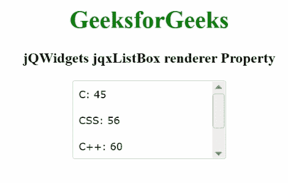

# jqwidgets jqxlistox 渲染器属性

> 原文:[https://www . geesforgeks . org/jqwidgets-jqxlistbox-renderer-property/](https://www.geeksforgeeks.org/jqwidgets-jqxlistbox-renderer-property/)

**jQWidgets** 是一个 JavaScript 框架，用于为 PC 和移动设备制作基于 web 的应用程序。它是一个非常强大、优化、独立于平台并且得到广泛支持的框架。jqxListBox 用于说明一个 jQuery ListBox 小部件，它包含一个可选择元素的列表。

**渲染器属性**是一个回调函数，每当渲染所述*列表框*中的项目时都会调用该函数。此外，该功能有助于定制所述列表项的视图。它属于函数类型，默认值为空。

**语法:**

要设置*渲染器*属性:

```html
$('#jqxListBox').jqxListBox({
    renderer: function (index, label, value) {
        var datarecord = data[index];
        return datarecord.firstname + " " + datarecord.lastname;
    }
});
```

要获取*渲染器*属性:

```html
var renderer = $('#jqxListBox').jqxListBox('renderer'); 
```

**链接文件:**从链接下载 [jQWidgets](https://www.jqwidgets.com/download/) 。在 HTML 文件中，找到下载文件夹中的脚本文件。

> <link rel="”stylesheet”" href="”jqwidgets/styles/jqx.base.css”" type="”text/css”">
> <脚本类型=【text/JavaScript】src =【scripts/jquery-1 . 11 . 1 . min . js】></脚本>
> <脚本类型=【text/JavaScript】src =【jqwidgets/jqx-all . js】></脚本>
> <脚本类型=【text/JavaScript】src =【jqwidgets/jqxcore

**示例:**以下示例说明了 jQWidgets 中的 jqxListBox **渲染器**属性。

## 超文本标记语言

```html
<!DOCTYPE html>
<html lang="en">

<head>
    <link rel="stylesheet" href=
        "jqwidgets/styles/jqx.base.css" type="text/css" />
    <script type="text/javascript" 
        src="scripts/jquery-1.11.1.min.js"></script>
    <script type="text/javascript" 
        src="jqwidgets/jqx-all.js"></script>
    <script type="text/javascript" 
        src="jqwidgets/jqxcore.js"></script>
    <script type="text/javascript" 
        src="jqwidgets/jqxbuttons.js"></script>
    <script type="text/javascript" 
        src="jqwidgets/jqxscrollbar.js"></script>
    <script type="text/javascript" 
        src="jqwidgets/jqxlistbox.js"></script>
</head>

<body>
    <center>
        <h1 style="color: green;">
            GeeksforGeeks
        </h1>

        <h3>
            jQWidgets jqxListBox renderer Property
        </h3>

        <div id="jqxLB"></div>
        <br />
    </center>

    <script type="text/javascript">
        $(document).ready(function () {
            var data = new Array();
            var subjectName = ["C:", "CSS:", 
                "C++:", "computer Science:"];

            var marks = ["45", "56", "60", "80"];
            var v = 0;

            for (var i = 0; i < subjectName.length; i++) {
                var r = {};
                r["subjectName"] = subjectName[v];
                r["marks"] = marks[v];
                data[i] = r;
                v++;
            }
            var src = {
                localdata: data,
                datatype: "array",
            };
            var data_Adapter = new $.jqx.dataAdapter(src);
            $("#jqxLB").jqxListBox({
                source: data_Adapter,
                width: "200px",
                height: "100px",
                displayMember: "subjectName",
                renderer: function (index, label, value) {
                    var data_record = data[index];
                    var t = '<table style="min-width: 150px;"><tr><td>'
                        + data_record.subjectName + " " + data_record.marks
                        + "</td></tr></table>";
                    return t;
                },
            });
        });
    </script>
</body>

</html>
```

**输出:**



渲染器属性

**参考:**[https://www . jqwidgets . com/jquery-widgets-documentation/documentation/jqxlistbox/jquery-listbox-API . htm？搜索=](https://www.jqwidgets.com/jquery-widgets-documentation/documentation/jqxlistbox/jquery-listbox-api.htm?search=)