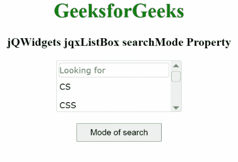

# jqwidgets jqxlistox search mode property

> 原文:[https://www . geesforgeks . org/jqwidgets-jqxlistbox-search mode-property/](https://www.geeksforgeeks.org/jqwidgets-jqxlistbox-searchmode-property/)

**jQWidgets** 是一个 JavaScript 框架，用于为 PC 和移动设备制作基于 web 的应用程序。它是一个非常强大、优化、独立于平台并且得到广泛支持的框架。jqxListBox 用于说明一个 jQuery ListBox 小部件，它包含一个可选择元素的列表。

**搜索模式属性**用于设置或返回项目的增量搜索模式。当用户输入一个有焦点的*列表框*时，这个属性很有用。其中， *jqxListBox* 小部件试图借助输入的文本和选择的搜索模式来确定搜索的项目。它接受字符串类型值，默认值为“startswith”。

它的可能值是:

*   没有
*   “包含”
*   '包含 ignorecase '
*   等于
*   ' equalsignorecase '
*   ' startswithignorecase '
*   '开始于'
*   ' endswithignorecase '
*   "结束"

**语法:**

要设置*搜索模式*属性:

```
$("#jqxListBox").jqxListBox({searchMode: 'contains' }); 
```

要获取*搜索模式*属性:

```
var searchMode = $('#jqxListBox').jqxListBox('searchMode');  
```

**链接文件:**从链接下载 [jQWidgets](https://www.jqwidgets.com/download/) 。在 HTML 文件中，找到下载文件夹中的脚本文件。

> <link rel="”stylesheet”" href="”jqwidgets/styles/jqx.base.css”" type="”text/css”">
> <脚本类型=【text/JavaScript】src =【scripts/jquery-1 . 11 . 1 . min . js】></脚本>
> <脚本类型=【text/JavaScript】src =【jqwidgets/jqx-all . js】></脚本>
> <脚本类型=【text/JavaScript】src =【jqwidgets/jqxcore

**示例:**以下示例说明了 jQWidgets 中的 jqxListBox **搜索模式**属性。

## 超文本标记语言

```
<html>
    <head>
        <link rel="stylesheet" 
              href="jqwidgets/styles/jqx.base.css" 
              type="text/css" />
        <script type="text/javascript"
                src="scripts/jquery-1.11.1.min.js">
        </script>
        <script type="text/javascript" 
                src="jqwidgets/jqx-all.js">
        </script>
        <script type="text/javascript" 
                src="jqwidgets/jqxcore.js">
        </script>
        <script type="text/javascript" 
                src="jqwidgets/jqxbuttons.js">
        </script>
        <script type="text/javascript" 
                src="jqwidgets/jqxscrollbar.js">
        </script>
        <script type="text/javascript" 
                src="jqwidgets/jqxlistbox.js">
        </script>
    </head>
    <body>
        <center>
            <h1 style="color: green;">
                GeeksforGeeks
            </h1>
            <h3>
                jQWidgets jqxListBox searchMode Property
            </h3>
            <div id="jqxLB"></div>
            <br />
            <input type="button" id="jqxBtn" 
                   style="padding: 5px 20px;" 
                   value="Mode of search" />
            <div id="log"></div>
        </center>

        <script type="text/javascript">
            $(document).ready(function () {
                var data = 
                    ["CS", "CSS", "C++", "Java", "Scala"];

                $("#jqxLB").jqxListBox({
                    source: data,
                    width: "200px",
                    height: "80px",
                    filterable: true,
                    searchMode: 'endswith'
                });

                $("#jqxBtn").on("click", function () {
                    var sm = 
                        $("#jqxLB").jqxListBox("searchMode");
                    $("#log").text("~" +sm);
                });
            });
        </script>
    </body>
</html>
```

**输出:**



**参考:**[https://www . jqwidgets . com/jquery-widgets-documentation/documentation/jqxlistbox/jquery-listbox-API . htm](https://www.jqwidgets.com/jquery-widgets-documentation/documentation/jqxlistbox/jquery-listbox-api.htm)