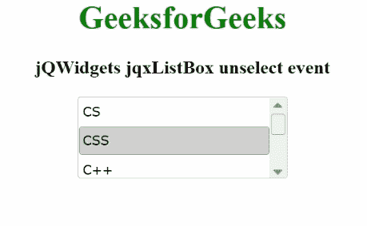

# jQWidgets jqxListBox 取消选择事件

> 原文:[https://www . geesforgeks . org/jqwidgets-jqxlistbox-unselect-event/](https://www.geeksforgeeks.org/jqwidgets-jqxlistbox-unselect-event/)

**jQWidgets** 是一个 JavaScript 框架，用于为 PC 和移动设备制作基于 web 的应用程序。它是一个非常强大、优化、独立于平台并且得到广泛支持的框架。jqxListBox 用于说明一个 jQuery ListBox 小部件，它包含一个可选择元素的列表。

每当用户从所述列表框中取消选择一个项目时，**取消选择**事件被激活。

**语法:**

```html
$('#jqxListBox').on('unselect', function (event) {});
```

项目对象拥有下面给定的字段。

*   标签
*   价值
*   有缺陷的
*   检查
*   hasThreeStates
*   超文本标记语言
*   指数
*   组

**链接文件:**从链接下载 [jQWidgets](https://www.jqwidgets.com/download/) 。在 HTML 文件中，找到下载文件夹中的脚本文件。

> <link rel="”stylesheet”" href="”jqwidgets/styles/jqx.base.css”" type="”text/css”">
> <脚本类型=【text/JavaScript】src =【scripts/jquery-1 . 11 . 1 . min . js】></脚本>
> <脚本类型=【text/JavaScript】src =【jqwidgets/jqx-all . js】></脚本>
> <脚本类型=【text/JavaScript】src =【jqwidgets/jqxcore

**示例:**以下示例说明了 jqxListBox **取消选择 jQWidgets 中的**事件。

## 超文本标记语言

```html
<!DOCTYPE html>
<html lang="en">
    <head>
        <link rel="stylesheet" href=
            "jqwidgets/styles/jqx.base.css" type="text/css" />
        <script type="text/javascript" 
            src="scripts/jquery-1.11.1.min.js"></script>
        <script type="text/javascript" 
            src="jqwidgets/jqx-all.js"></script>
        <script type="text/javascript" 
            src="jqwidgets/jqxcore.js"></script>
        <script type="text/javascript" 
            src="jqwidgets/jqxbuttons.js"></script>
        <script type="text/javascript" 
            src="jqwidgets/jqxscrollbar.js"></script>
        <script type="text/javascript" 
            src="jqwidgets/jqxlistbox.js"></script>
    </head>

    <body>
        <center>
            <h1 style="color: green;">
                GeeksforGeeks
            </h1>

            <h3>
                jQWidgets jqxListBox unselect event
            </h3>

            <div id="jqxLB"></div>
            <br />
            <div id="log"></div>
        </center>

        <script type="text/javascript">
            $(document).ready(function () {
                var data = ["CS", "CSS", "C++", "Java", "Scala"];

                $("#jqxLB").jqxListBox({
                    source: data,
                    width: "210px",
                    height: "80px",
                    selectedIndex: 1,
                });

                $("#jqxLB").on("unselect", function (event) {
                    var args = event.args;

                    if (args) {
                        if (!args.item) return;
                        $("#log").html(args.item.value
                          + " is unselected");
                    }
                });
            });
        </script>
    </body>
</html>
```

**输出:**



取消选择事件

**参考:**[https://www . jqwidgets . com/jquery-widgets-documentation/documentation/jqxlistbox/jquery-listbox-API . htm？搜索=](https://www.jqwidgets.com/jquery-widgets-documentation/documentation/jqxlistbox/jquery-listbox-api.htm?search=)