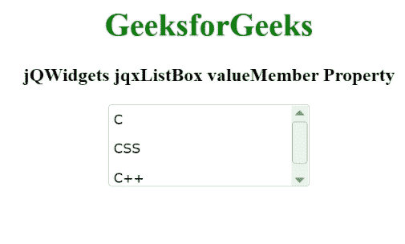

# jQWidgets jqxListBox value member 属性

> 原文:[https://www . geesforgeks . org/jqwidgets-jqxlistbox-value member-property/](https://www.geeksforgeeks.org/jqwidgets-jqxlistbox-valuemember-property/)

**jQWidgets** 是一个 JavaScript 框架，用于为 PC 和移动设备制作基于 web 的应用程序。它是一个非常强大、优化、独立于平台并且得到广泛支持的框架。jqxListBox 用于说明一个 jQuery ListBox 小部件，它包含一个可选择元素的列表。

**值成员属性**用于从所述列表框中设置或返回项目的*值成员*。此外，该属性定义了对象属性的名称，以便将其设置为列表中指定项目的“*值*”。其中名称被限制在由“*来源*属性声明的集合中。它的类型为字符串，默认值为“”。

**语法:**

要设置*值成员*属性:

```html
$("#jqxListBox").jqxListBox({valueMember: 'lastName'});
```

要获取*值成员*属性:

```html
var valueMember = $('#jqxListBox').jqxListBox('valueMember'); 
```

**链接文件:**从链接下载 [jQWidgets](https://www.jqwidgets.com/download/) 。在 HTML 文件中，找到下载文件夹中的脚本文件。

> <link rel="”stylesheet”" href="”jqwidgets/styles/jqx.base.css”" type="”text/css”">
> <脚本类型=【text/JavaScript】src =【scripts/jquery-1 . 11 . 1 . min . js】></脚本>
> <脚本类型=【text/JavaScript】src =【jqwidgets/jqx-all . js】></脚本>
> <脚本类型=【text/JavaScript】src =【jqwidgets/jqxcore

**示例:**以下示例说明了 jQWidgets 中的 jqxListBox **valueMember** 属性。

## 超文本标记语言

```html
<!DOCTYPE html>
<html lang="en">
    <head>
      <link rel="stylesheet" href=
   "jqwidgets/styles/jqx.base.css" type="text/css" />
      <script type="text/javascript" src="scripts/jquery-1.11.1.min.js">
      </script>
      <script type="text/javascript" src="jqwidgets/jqx-all.js">
      </script>
      <script type="text/javascript" src="jqwidgets/jqxcore.js">
      </script>
      <script type="text/javascript" src=".jqwidgets/jqxbuttons.js">
      </script>
      <script type="text/javascript" src="jqwidgets/jqxscrollbar.js">
      </script>
      <script type="text/javascript" src="jqwidgets/jqxlistbox.js">
      </script>
    </head>

    <body>
        <center>
            <h1 style="color: green;">
                GeeksforGeeks
            </h1>

            <h3>
                jQWidgets jqxListBox valueMember Property
            </h3>

            <div id="jqxLB"></div>
            <br />
            <div id="log"></div>
        </center>

        <script type="text/javascript">
            $(document).ready(function () {
                var data = [
                    {
                        name: "C",
                        index: 0,
                    },
                    {
                        name: "CSS",
                        index: 1,
                    },
                    {
                        name: "C++",
                        index: 2,
                    },
                ];

                $("#jqxLB").jqxListBox({
                    source: data,
                    width: "200px",
                    height: "80px",
                    displayMember: "name",
                    valueMember: "index",
                });

                $("#jqxLB").on("change", function (evnt) {
                    $("#log").html("name: " + evnt.args.item.label +
                                   ", val: " + evnt.args.item.value);
                });
            });
        </script>
    </body>
</html>
```

**输出:**



valueMember 属性

**参考:**[https://www . jqwidgets . com/jquery-widgets-documentation/documentation/jqxlistbox/jquery-listbox-API . htm？搜索=](https://www.jqwidgets.com/jquery-widgets-documentation/documentation/jqxlistbox/jquery-listbox-api.htm?search=)