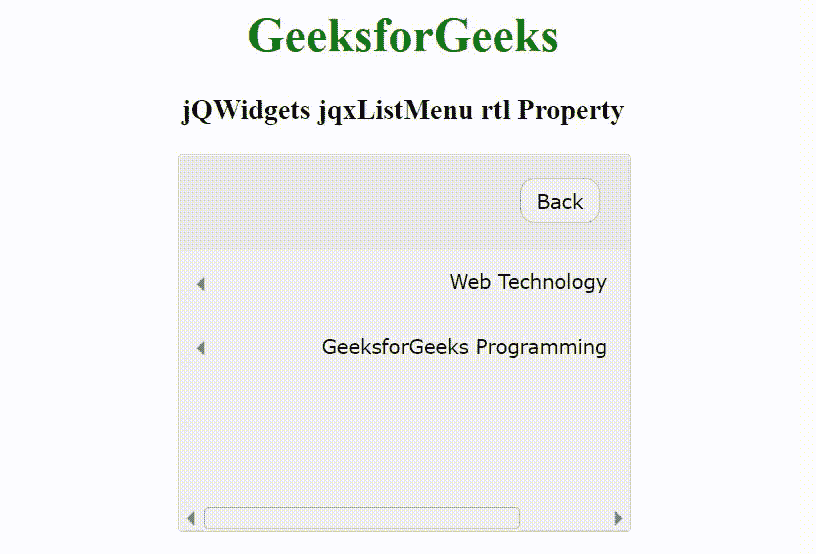

# jqwidgets jqxlist enu RTL 属性

> 哎哎哎:# t0]https://www . geeksforgeeks . org/jqwidgets-jqxlstmenu-RTL-property/

jQWidgets 是一个 JavaScript 框架，用于为 PC 和移动设备制作基于 web 的应用程序。它是一个非常强大、优化、独立于平台并且得到广泛支持的框架。jqxListMenu 是一个 jQuery 小部件，用于显示有序和无序列表的集合。我们可以通过使用有序列表和无序列表来创建嵌套列表。

**rtl 属性**用于设置或返回一个值，该值指示小部件的元素是否对齐以支持使用从右向左字体的区域设置。它接受布尔类型值，默认值为 false。

**语法:**

*   设置 rtl 属性。

    ```html
    $('selector').jqxListMenu({ rtl: Boolean });
    ```

*   归还 rtl 的财产。

    ```html
    var rtl = $('selector').jqxListMenu('rtl');
    ```

**链接文件:**从链接 https://www.jqwidgets.com/download/.下载 jQWidgets 在 HTML 文件中，找到下载文件夹中的脚本文件。

> <link rel="”stylesheet”" href="”jqwidgets/styles/jqx.base.css”" type="”text/css”">
> <脚本类型=“text/JavaScript”src =“scripts/jquery-1 . 11 . 1 . min . js”></script>
> <脚本类型=“text/JavaScript”src =“jqwidgets/jqxcore . js”></script>
> <脚本类型=“text/JavaScript”src =“jqwidgets/jqx-1

下面的例子说明了 jQWidgets 中的 jqxListMenu rtl 属性。

**示例:**

## 超文本标记语言

```html
<!DOCTYPE html>
<html lang="en">

<head>
    <link rel="stylesheet" 
          href="jqwidgets/styles/jqx.base.css" 
          type="text/css" />
    <script type="text/javascript" 
            src="scripts/jquery-1.11.1.min.js">
    </script>
    <script type="text/javascript" 
            src="jqwidgets/jqxcore.js">
    </script>
    <script type="text/javascript" 
            src="jqwidgets/jqx-all.js">
    </script>
    <script type="text/javascript" 
            src="jqwidgets/jqxdata.js">
    </script>
    <script type="text/javascript" 
            src="jqwidgets/jqxlistmenu.js">
    </script>
    <script type="text/javascript" 
            src="jqwidgets/jqxpanel.js">
    </script>
    <script type="text/javascript" 
            src="jqwidgets/jqxscrollbar.js">
    </script>
    <script type="text/javascript" 
            src="jqwidgets/jqxbuttons.js">
    </script>

    <style>
        h1,
        h3 {
            text-align: center;
        }

        #GFG {
            width: 100%;
            margin: 0 auto;
        }
    </style>
</head>

<body>
    <h1 style="color: green;">
        GeeksforGeeks
    </h1>

    <h3>
        jQWidgets jqxListMenu rtl Property
    </h3>

    <div id="GFG" style="width: 300px;">
        <ul id="list" data-role="listmenu">
            <li>Web Technology
                <ul data-role="listmenu">
                    <li>Frontend Development
                        <ul data-role="listmenu">
                            <li>HTML</li>
                            <li>CSS</li>
                            <li>JavaScript</li>
                            <li>jQuery</li>
                        </ul>
                    </li>
                    <li>Backend Development
                        <ul data-role="listmenu">
                            <li>PHP</li>
                            <li>Node.js</li>
                            <li>Python</li>
                            <li>Java</li>
                        </ul>
                    </li>
                </ul>
            </li>
            <li>GeeksforGeeks Programming
                <ul data-role="listmenu">
                    <li>C++</li>
                    <li>Java</li>
                    <li>Python</li>
                </ul>
            </li>
        </ul>
    </div>

    <script type="text/javascript">
        $(document).ready(function () {
            $('#list').jqxListMenu({
                width: 300,
                height: 250,
                showHeader: true,
                showBackButton: true,
                showFilter: false,
                rtl: true
            });
        });
    </script>
</body>

</html>
```

**输出:**



**参考:**[https://www . jqwidgets . com/jquery widgets-documentation/jqxlstmenu/jquery-list menu-API . htm](https://www.jqwidgets.com/jquery-widgets-documentation/documentation/jqxlistmenu/jquery-listmenu-api.htm)