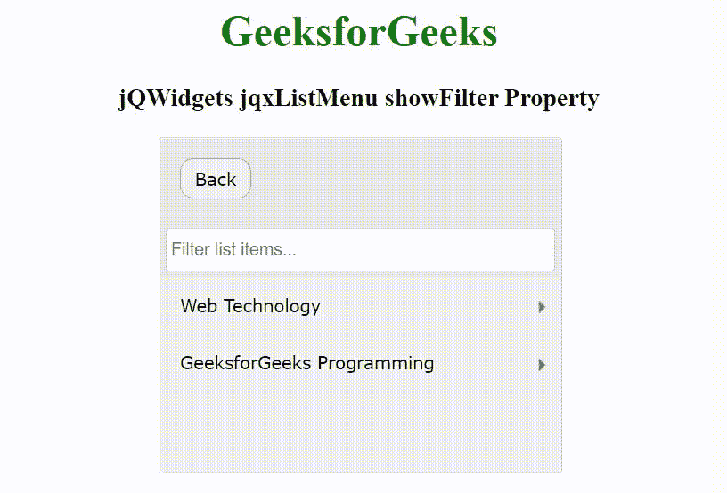

# jqwidgets jqxlist menu show filter property

> 原文:[https://www . geesforgeks . org/jqwidgets-jqxlistmenu-show filter-property/](https://www.geeksforgeeks.org/jqwidgets-jqxlistmenu-showfilter-property/)

**jQWidgets** 是一个 JavaScript 框架，用于为 PC 和移动设备制作基于 web 的应用程序。它是一个非常强大、优化、独立于平台并且得到广泛支持的框架。jqxListMenu 是一个 jQuery 小部件，用于显示有序和无序列表的集合。我们可以通过使用有序列表和无序列表来创建嵌套列表。

**显示过滤器**属性用于设置或返回过滤器输入字段是否可见。它接受布尔类型值，默认值为 false。

**语法:**

*   设置**显示过滤器**属性。

    ```html
    $('selector').jqxListMenu({ showFilter: Boolean });
    ```

*   返回**显示过滤器**属性。

    ```html
    var showFilter = $('selector').jqxListMenu('showFilter');
    ```

**链接文件:**从链接 https://www.jqwidgets.com/download/.下载 jQWidgets 在 HTML 文件中，找到下载文件夹中的脚本文件。

> <link rel="”stylesheet”" href="”jqwidgets/styles/jqx.base.css”" type="”text/css”">
> <脚本类型=“text/JavaScript”src =“scripts/jquery-1 . 11 . 1 . min . js”></script>
> <脚本类型=“text/JavaScript”src =“jqwidgets/jqxcore . js”></script>
> <脚本类型=“text/JavaScript”src =“jqwidgets/jqx-1

下面的例子说明了 jQWidgets 中的 jqxListMenu **showFilter** 属性。

**示例:**

## 超文本标记语言

```html
<!DOCTYPE html>
<html lang="en">

<head>
    <link rel="stylesheet"
            href="jqwidgets/styles/jqx.base.css" 
            type="text/css" />
    <script type="text/javascript" 
            src="scripts/jquery-1.11.1.min.js">
    </script>
    <script type="text/javascript" 
            src="jqwidgets/jqxcore.js">
    </script>
    <script type="text/javascript" 
            src="jqwidgets/jqx-all.js">
    </script>
    <script type="text/javascript" 
            src="jqwidgets/jqxdata.js">
    </script>
    <script type="text/javascript" 
            src="jqwidgets/jqxlistmenu.js">
    </script>
    <script type="text/javascript" 
            src="jqwidgets/jqxpanel.js">
    </script>
    <script type="text/javascript" 
            src="jqwidgets/jqxscrollbar.js">
    </script>
    <script type="text/javascript" 
            src="jqwidgets/jqxbuttons.js">
    </script>

    <style>
        h1,
        h3 {
            text-align: center;
        }

        #GFG {
            width: 100%;
            margin: 0 auto;
        }
    </style>
</head>

<body>
    <h1 style="color: green;">
        GeeksforGeeks
    </h1>

    <h3>
        jQWidgets jqxListMenu showFilter Property
    </h3>

    <div id="GFG" style="width: 300px;">
        <ul id="list" data-role="listmenu">
            <li>Web Technology
                <ul data-role="listmenu">
                    <li>Frontend Development
                        <ul data-role="listmenu">
                            <li>HTML</li>
                            <li>CSS</li>
                            <li>JavaScript</li>
                            <li>jQuery</li>
                        </ul>
                    </li>
                    <li>Backend Development
                        <ul data-role="listmenu">
                            <li>PHP</li>
                            <li>Node.js</li>
                            <li>Python</li>
                            <li>Java</li>
                        </ul>
                    </li>
                </ul>
            </li>
            <li>GeeksforGeeks Programming
                <ul data-role="listmenu">
                    <li>C++</li>
                    <li>Java</li>
                    <li>Python</li>
                </ul>
            </li>
        </ul>
    </div>

    <script type="text/javascript">
        $(document).ready(function () {
            $('#list').jqxListMenu({
                width: 300,
                height: 250,
                showHeader: true,
                showBackButton: true,
                showFilter: true
            });
        });
    </script>
</body>

</html>
```

**输出:**



**参考:**[https://www . jqwidgets . com/jquery widgets-documentation/jqxlstmenu/jquery-list menu-API . htm](https://www.jqwidgets.com/jquery-widgets-documentation/documentation/jqxlistmenu/jquery-listmenu-api.htm)