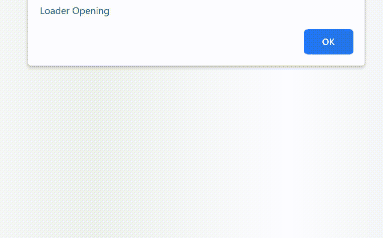

# jQWidgets jqxlloader 创建事件

> 原文:[https://www . geesforgeks . org/jqwidgets-jqxlloader-create-event/](https://www.geeksforgeeks.org/jqwidgets-jqxloader-create-event/)

jQWidgets 是一个 JavaScript 框架，用于为 PC 和移动设备制作基于 web 的应用程序。它是一个非常强大、优化、独立于平台并且得到广泛支持的框架。jqxLoader 代表一个显示内置加载器元素的 jQuery 小部件。加载程序可以包含图标或文本或图标和文本的组合。加载器元素可以被加载，直到小部件的数据被加载。

**创建事件**用于用户首次创建加载程序时触发。

**语法:**

```html
$('Selector').on('create', function () {  });
```

**链接文件:**从给定的链接 https://www.jqwidgets.com/download/.下载 jQWidgets 在 HTML 文件中，找到下载文件夹中的脚本文件。

> <link rel="”stylesheet”" href="”jqwidgets/styles/jqx.base.css”" type="”text/css”">
> <脚本类型=【文本/JavaScript】src =【脚本/jquery-1 . 11 . 1 . min . js】></脚本>
> T8】脚本类型=【文本/JavaScript】src =【jqwidgets/jqxcore . js】></脚本>
> <脚本类型=【文本/JavaScript】src =【jqwidgets/jqxlloader . js】。

下面的例子说明了 jQWidgets jqxLoader 创建事件。

**示例:**

## 超文本标记语言

```html
<!DOCTYPE html>
<html lang="en">

<head>
    <link rel="stylesheet" href=
        "jqwidgets/styles/jqx.base.css" type="text/css" />
    <script type="text/javascript" 
        src="scripts/jquery-1.11.1.min.js"></script>
    <script type="text/javascript" 
        src="jqwidgets/jqxcore.js"></script>
    <script type="text/javascript" 
        src="jqwidgets/jqxloader.js"></script>
</head>

<body>
    <center>
        <h1 style="color: green;">
            GeeksforGeeks
        </h1>

        <h3>
            jQWidgets jqxLoader create Event
        </h3>

        <div style="margin-top: 130px;" 
            id="jqxLoader">
        </div>
    </center>

    <script type="text/javascript">
        $(document).ready(function() {
            $('#jqxLoader').on('create', function() {
                alert("Loader Opening")
            });

            $("#jqxLoader").jqxLoader({
                width: 250,
                height: 150,
                autoOpen: true
            });
        });
    </script>
</body>

</html>
```

**输出:**



**参考:**[https://www . jqwidgets . com/jquery-widgets-documentation/documentation/jqxloader/jquery-loader-API . htm](https://www.jqwidgets.com/jquery-widgets-documentation/documentation/jqxloader/jquery-loader-api.htm)