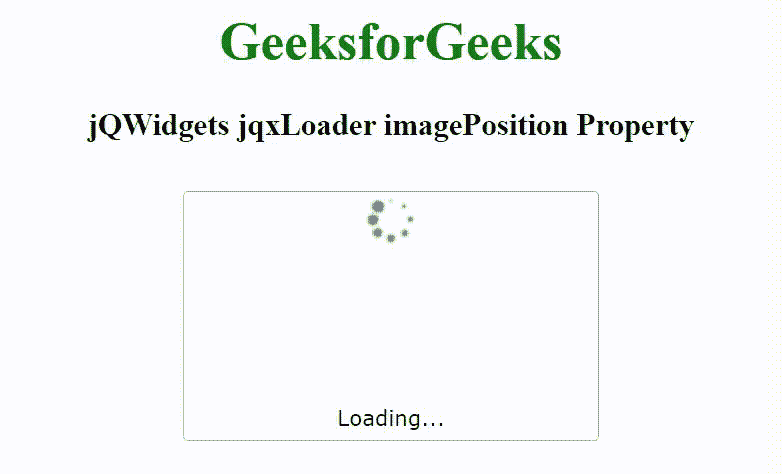

# jQWidgets jqxlloader imagePosition 属性

> 原文:[https://www . geesforgeks . org/jqwidgets-jqxloader-image position-property/](https://www.geeksforgeeks.org/jqwidgets-jqxloader-imageposition-property/)

jQWidgets 是一个 JavaScript 框架，用于为 PC 和移动设备制作基于 web 的应用程序。它是一个非常强大、优化、独立于平台并且得到广泛支持的框架。jqxLoader 代表一个显示内置加载器元素的 jQuery 小部件。加载程序可以包含图标或文本，或者图标和文本的组合。加载器元素可以被加载，直到小部件的数据被加载。

***图像位置*** **属性**用于设置或返回图像的位置。它接受字符串类型的值，默认值是“中心”。

它的可能值如下

*   ' top '
*   '底部'
*   “中心”

**语法:**

设置*图像位置*属性。

```html
$('selector').jqxLoader({ imagePosition: String });
```

返回*图像位置*属性。

```html
var imagePosition = $('selector').jqxLoader('imagePosition');
```

**链接文件:**从给定链接下载 [jQWidgets](https://www.jqwidgets.com/download/.) 。在 HTML 文件中，找到下载文件夹中的脚本文件。

> <link rel="”stylesheet”" href="”jqwidgets/styles/jqx.base.css”" type="”text/css”">
> < link rel= "样式表" href = " jqwidgets/style/jqx . energy blue . CSS " type = " text/CSS "/>
> <script type = " text/JavaScript " src = " scripts/jquery-1 . 11 . 1 . min . js "></script>
> <script type = " text/JavaScript " src = " jqwidgets/jqxcore . js

**示例:**下面的示例说明了 jQWidgets jqxlloader imagePosition 属性。

## 超文本标记语言

```html
<!DOCTYPE html>
<html lang="en">

<head>
    <link rel="stylesheet" href=
        "jqwidgets/styles/jqx.base.css" type="text/css" />
    <link rel="stylesheet" href=
        "jqwidgets/styles/jqx.energyblue.css" type="text/css" />
    <script type="text/javascript" 
        src="scripts/jquery-1.11.1.min.js"></script>
    <script type="text/javascript" 
        src="jqwidgets/jqxcore.js"></script>
    <script type="text/javascript" 
        src="jqwidgets/jqxloader.js"></script>
</head>

<body>
    <center>
        <h1 style="color: green;">
            GeeksforGeeks
        </h1>

        <h3>
            jQWidgets jqxLoader imagePosition Property
        </h3>
        <div style="margin-top: 130px;" 
            id="jqxLoader">
        </div>
    </center>

     <script type="text/javascript">
        $(document).ready(function() {
            $("#jqxLoader").jqxLoader({
                width: 250,
                height: 150,
                autoOpen: true,
                imagePosition: 'top'
            });
        });
    </script>
</body>

</html>
```

**输出:**



**参考:**[https://www . jqwidgets . com/jquery-widgets-documentation/documentation/jqxloader/jquery-loader-API . htm](https://www.jqwidgets.com/jquery-widgets-documentation/documentation/jqxloader/jquery-loader-api.htm)