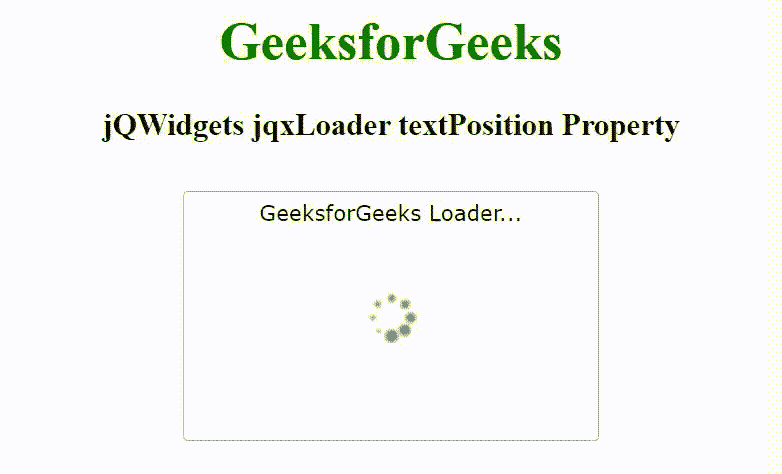

# jQWidgets jqxlloader 文本位置属性

> 原文:[https://www . geesforgeks . org/jqwidgets-jqxloader-text position-property/](https://www.geeksforgeeks.org/jqwidgets-jqxloader-textposition-property/)

jQWidgets 是一个 JavaScript 框架，用于为 PC 和移动设备制作基于 web 的应用程序。它是一个非常强大、优化、独立于平台并且得到广泛支持的框架。jqxLoader 代表一个显示内置加载器元素的 jQuery 小部件。加载程序可以包含图标或文本或图标和文本的组合。加载器元素可以被加载，直到小部件的数据被加载。

**文本位置属性**用于设置或返回文本内容的对齐方式。它接受字符串类型值，默认值为“底部”。

**语法:**

设置文本位置属性。

```
$('selector').jqxLoader({ textPosition: String });
```

返回文本位置属性。

```
var textPosition = $('selector').jqxLoader('textPosition');
```

**链接文件:**从给定的链接 https://www.jqwidgets.com/download/.下载 jQWidgets 在 HTML 文件中，找到下载文件夹中的脚本文件。

> <link rel="”stylesheet”" href="”jqwidgets/styles/jqx.base.css”" type="”text/css”">
> < link rel= "样式表" href = " jqwidgets/style/jqx . energy blue . CSS " type = " text/CSS "/>
> <script type = " text/JavaScript " src = " scripts/jquery-1 . 11 . 1 . min . js "></script>
> <script type = " text/JavaScript " src = " jqwidgets/jqxcore . js

下面的例子说明了 jQWidgets jqxLoader 的 textPosition 属性。

**示例:**

## 超文本标记语言

```
<!DOCTYPE html>
<html lang="en">

<head>
    <link rel="stylesheet" href=
        "jqwidgets/styles/jqx.base.css" type="text/css" />
    <link rel="stylesheet" href=
        "jqwidgets/styles/jqx.energyblue.css" type="text/css" />
    <script type="text/javascript" 
        src="scripts/jquery-1.11.1.min.js"></script>
    <script type="text/javascript" 
        src="jqwidgets/jqxcore.js"></script>
    <script type="text/javascript" 
        src="jqwidgets/jqxloader.js"></script>
</head>

<body>
    <center>
        <h1 style="color: green;">
            GeeksforGeeks
        </h1>

        <h3>
            jQWidgets jqxLoader textPosition Property
        </h3>

        <div style="margin-top: 130px;" 
            id="jqxLoader">
        </div>
    </center>

    <script type="text/javascript">
        $(document).ready(function() {
            $("#jqxLoader").jqxLoader({
                width: 250,
                height: 150,
                autoOpen: true,
                textPosition: 'top',
                text: "GeeksforGeeks Loader..."
            });
        });
    </script>
</body>

</html>
```

**输出:**



**参考:**[https://www . jqwidgets . com/jquery-widgets-documentation/documentation/jqxloader/jquery-loader-API . htm](https://www.jqwidgets.com/jquery-widgets-documentation/documentation/jqxloader/jquery-loader-api.htm)