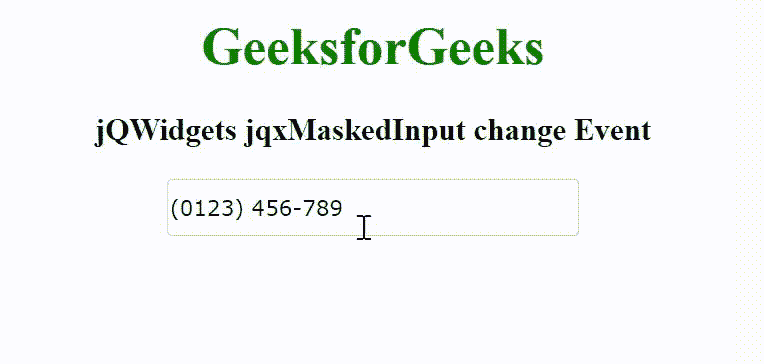

# jQWidgets jqxMaskedInput 变更事件

> 原文:[https://www . geesforgeks . org/jqwidgets-jqxmaskedinput-change-event/](https://www.geeksforgeeks.org/jqwidgets-jqxmaskedinput-change-event/)

jQWidgets 是一个 JavaScript 框架，用于为 PC 和移动设备制作基于 web 的应用程序。它是一个非常强大、优化、独立于平台并且得到广泛支持的框架。jqxMaskedInput 表示一个 jQuery 小部件，用于添加掩码，以适当的方式区分输入的数字。这个小部件主要用来写电话号码、邮政编码、日期等。通过使用面具。

变更事件用于在 jqxMaskedInput 小部件值变更且控件焦点丢失时触发。

**语法:**

```
$('Selector').on('change', function() {  }); 
```

**链接文件:**从给定的链接 https://www.jqwidgets.com/download/.下载 jQWidgets 在 HTML 文件中，找到下载文件夹中的脚本文件。

> <link rel="”stylesheet”" href="”jqwidgets/styles/jqx.base.css”" type="”text/css”">

下面的例子说明了 jQWidgets jqxMaskedInput 变更事件。

**示例:**

## 超文本标记语言

```
<!DOCTYPE html>
<html lang="en">

<head>
    <link rel="stylesheet" href=
        "jqwidgets/styles/jqx.base.css" type="text/css" />
    <script type="text/javascript" 
        src="scripts/jquery-1.11.1.min.js"></script>
    <script type="text/javascript" 
        src="jqwidgets/jqxcore.js"></script>
    <script type="text/javascript" 
        src="jqwidgets/jqxmaskedinput.js"></script>
</head>

<body>
    <center>
        <h1 style="color: green;">
            GeeksforGeeks
        </h1>

        <h3>
            jQWidgets jqxMaskedInput change Event
        </h3>

        <input id='jqxMI'/>
    </center>

    <script type="text/javascript">
        $(document).ready(function() {
            $("#jqxMI").jqxMaskedInput({
                width: '250px',
                height: '35px',
                mask: '(####) ###-###',
                value: '0123456789'
            });

            $("#jqxMI").on('change', function() {
                alert('Input value changed')
            })
        });
    </script>
</body>

</html>
```

**输出:**



**参考:**[https://www . jqwidgets . com/jquery-widgets-documentation/documentation/jqxmaskedinput/jquery-masked-input-API . htm](https://www.jqwidgets.com/jquery-widgets-documentation/documentation/jqxmaskedinput/jquery-masked-input-api.htm)