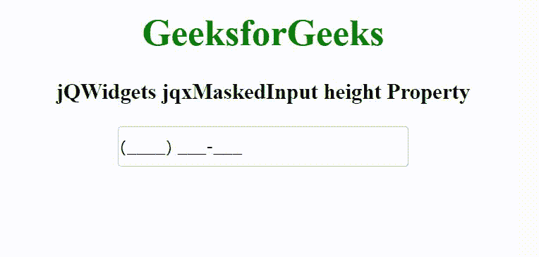

# jQWidgets jqxMaskedInput 高度属性

> 原文:[https://www . geesforgeks . org/jqwidgets-jqxmaskedinput-height-property/](https://www.geeksforgeeks.org/jqwidgets-jqxmaskedinput-height-property/)

jQWidgets 是一个 JavaScript 框架，用于为 PC 和移动设备制作基于 web 的应用程序。它是一个非常强大、优化、独立于平台并且得到广泛支持的框架。jqxMaskedInput 表示一个 jQuery 小部件，用于添加掩码，以适当的方式区分输入的数字。这个小部件主要用来写电话号码、邮政编码、日期等。通过使用面具。

**高度属性**用于设置或返回屏蔽输入的高度。它接受数字/字符串类型的值，默认值为空。

**语法:**

设置高度属性。

```
$('selector').jqxMaskedInput({ height: Number/String });
```

返回高度属性。

```
var height = $('selector').jqxMaskedInput('height');
```

**链接文件:**从给定的链接 https://www.jqwidgets.com/download/.下载 jQWidgets 在 HTML 文件中，找到下载文件夹中的脚本文件。

> <link rel="”stylesheet”" href="”jqwidgets/styles/jqx.base.css”" type="”text/css”">
> <脚本类型= " text/JavaScript " src = " scripts/jquery-1 . 11 . 1 . min . js "></脚本类型>
> <脚本类型= " text/JavaScript " src = " jqwidgets/jqxcore . js "></脚本类型>
> <脚本类型= " text/JavaScript " src = " jqwidgets/jqxmaskedinput . js。

下面的例子说明了 jQWidgets jqxMaskedInput 高度属性。

**示例:**

## 超文本标记语言

```
<!DOCTYPE html>
<html lang="en">

<head>
    <link rel="stylesheet" href=
        "jqwidgets/styles/jqx.base.css" type="text/css" />
    <script type="text/javascript" 
        src="scripts/jquery-1.11.1.min.js"></script>
    <script type="text/javascript" 
        src="jqwidgets/jqxcore.js"></script>
    <script type="text/javascript" 
        src="jqwidgets/jqxmaskedinput.js"></script>
</head>

<body>
    <center>
        <h1 style="color: green;">
            GeeksforGeeks
        </h1>

        <h3>
            jQWidgets jqxMaskedInput height Property
        </h3>

        <input id='jqxMI'/>
    </center>

    <script type="text/javascript">
        $(document).ready(function() {
            $("#jqxMI").jqxMaskedInput({
                width: '250px',
                height: '35px',
                mask: '(####) ###-###'
            });
        });
    </script>
</body>

</html>
```

**输出:**



**参考:**[https://www . jqwidgets . com/jquery-widgets-documentation/documentation/jqxmaskedinput/jquery-masked-input-API . htm](https://www.jqwidgets.com/jquery-widgets-documentation/documentation/jqxmaskedinput/jquery-masked-input-api.htm)