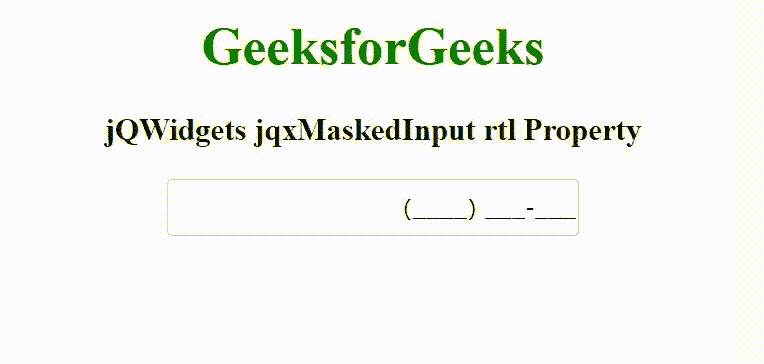

# jq 构件 jqxMaskedInput rtl 属性

> 原文:[https://www . geeksforgeeks . org/jqwidgets-jqxmaskedinput-RTL-property/](https://www.geeksforgeeks.org/jqwidgets-jqxmaskedinput-rtl-property/)

jQWidgets 是一个 JavaScript 框架，用于为 PC 和移动设备制作基于 web 的应用程序。它是一个非常强大、优化、独立于平台并且得到广泛支持的框架。jqxMaskedInput 表示一个 jQuery 小部件，用于添加掩码，以适当的方式区分输入的数字。这个小部件主要用来写电话号码、邮政编码、日期等。通过使用面具。

rtl 属性用于设置或返回一个值，该值指示小部件元素是否对齐以支持使用从右向左字体的区域设置。它接受布尔类型值，默认值为 false。

**语法:**

设置 rtl 属性。

```html
$('selector').jqxMaskedInput({ rtl: Boolean });
```

归还 rtl 的财产。

```html
var rtl = $('selector').jqxMaskedInput('rtl');
```

**链接文件:**从给定的链接 https://www.jqwidgets.com/download/.下载 jQWidgets 在 HTML 文件中，找到下载文件夹中的脚本文件。

> <link rel="”stylesheet”" href="”jqwidgets/styles/jqx.base.css”" type="”text/css”">

下面的例子说明了 rtl 属性。

**示例:**

## 超文本标记语言

```html
<!DOCTYPE html>
<html lang="en">

<head>
    <link rel="stylesheet" href=
        "jqwidgets/styles/jqx.base.css" type="text/css" />
    <script type="text/javascript" 
        src="scripts/jquery-1.11.1.min.js"></script>
    <script type="text/javascript" 
        src="jqwidgets/jqxcore.js"></script>
    <script type="text/javascript" 
        src="jqwidgets/jqxmaskedinput.js"></script>
</head>

<body>
    <center>
        <h1 style="color: green;">
            GeeksforGeeks
        </h1>

        <h3>
            jQWidgets jqxMaskedInput rtl Property
        </h3>

        <input id='jqxMI'/>
    </center>

    <script type="text/javascript">
        $(document).ready(function() {
            $("#jqxMI").jqxMaskedInput({
                width: '250px',
                height: '35px',
                mask: '(####) ###-###',
                rtl: true
            });
        });
    </script>
</body>

</html>
```

**输出:**



**参考:**[https://www . jqwidgets . com/jquery-widgets-documentation/documentation/jqxmaskedinput/jquery-masked-input-API . htm](https://www.jqwidgets.com/jquery-widgets-documentation/documentation/jqxmaskedinput/jquery-masked-input-api.htm)