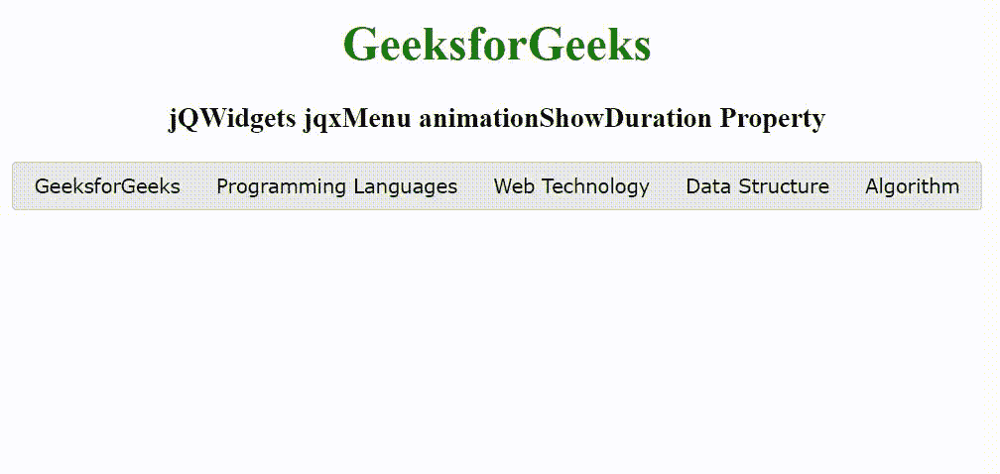

# jQWidgets jqxMenu animationshoulduration 属性

> 原文:[https://www . geeksforgeeks . org/jqwidgets-jqxmenu-animationshoutduration-property/](https://www.geeksforgeeks.org/jqwidgets-jqxmenu-animationshowduration-property/)

jQWidgets 是一个 JavaScript 框架，用于为 PC 和移动设备制作基于 web 的应用程序。它是一个非常强大、优化、独立于平台并且得到广泛支持的框架。jqxMenu 代表一个 jQuery 菜单小部件，用于创建网站或 web 应用程序的菜单。jqxMenu 小部件可以用来创建网站菜单、定制的上下文菜单或应用程序风格的菜单栏，只需少量的脚本。

**动画显示持续时间属性**用于设置或返回表演动画的持续时间。它接受数字类型值，默认值为 350。

**语法:**

设置动画设置持续时间属性。

```
$('selector').jqxMenu({ animationShowDuration: Number });
```

返回 animationShowDuration 属性。

```
var dur = $('selector').jqxMenu('animationShowDuration');
```

**链接文件:**从给定的链接 https://www.jqwidgets.com/download/.下载 jQWidgets 在 HTML 文件中，找到下载文件夹中的脚本文件。

> <link rel="”stylesheet”" href="”jqwidgets/styles/jqx.base.css”" type="”text/css”">
> <脚本类型= " text/JavaScript " src = " scripts/jquery-1 . 11 . 1 . min . js "></脚本类型>
> <脚本类型= " text/JavaScript " src = " jqwidgets/jqxcore . js "></脚本类型>
> <脚本类型= " text/JavaScript " src = " jqwidgets/jqx-all . js

下面的例子说明了 jQWidgets jqxMenu animationshoulduration 属性。

**示例:**

## 超文本标记语言

```
<!DOCTYPE html>
<html lang="en">

<head>
    <link rel="stylesheet" href=
        "jqwidgets/styles/jqx.base.css" type="text/css" />
    <script type="text/javascript" 
        src="scripts/jquery-1.11.1.min.js"></script>
    <script type="text/javascript" 
        src="jqwidgets/jqxcore.js"></script>
    <script type="text/javascript" 
        src="jqwidgets/jqx-all.js"></script>
    <script type="text/javascript" 
        src="jqwidgets/jqxmenu.js"></script>

    <style>
        h1,
        h3 {
            text-align: center;
        }

        #jqxMenu {
            width: 100%;
            margin: 0 auto;
        }
    </style>
</head>

<body>
    <h1 style="color: green;">
        GeeksforGeeks
    </h1>

    <h3>
        jQWidgets jqxMenu animationShowDuration Property
    </h3>

    <div id='jqxWidget'>
        <div id='jqxMenu'>
            <ul>
                <li><a href="#">GeeksforGeeks</a></li>
                <li>Programming Languages
                    <ul>
                        <li><a href="#">C</a></li>
                        <li><a href="#">C++</a></li>
                        <li><a href="#">Java</a></li>
                        <li><a href="#">Python</a></li>
                        <li><a href="#">C#</a></li>
                    </ul>
                </li>
                <li>Web Technology
                    <ul>
                        <li><a href="#">Frontend</a>
                            <ul>
                                <li><a href="#">HTML</a></li>
                                <li><a href="#">CSS</a></li>
                                <li><a href="#">JavaScript</a></li>
                                <li><a href="#">ReactJS</a></li>
                            </ul>
                        </li>
                        <li><a href="#">Backend</a>
                            <ul>
                                <li><a href="#">PHP</a></li>
                                <li><a href="#">Node.js</a></li>
                            </ul>
                        </li>
                    </ul>
                </li>
                <li><a href="#">Data Structure</a></li>
                <li><a href="#">Algorithm</a></li>
            </ul>
        </div>
    </div>

    <script type="text/javascript">
        $(document).ready(function() {
            $("#jqxMenu").jqxMenu({
                width: '650',
                animationShowDuration: 2000
            });
        });
    </script>
</body>

</html>
```

**输出:**



**参考:**[https://www . jqwidgets . com/jquery-widgets-documentation/documentation/jqxmenu/jquery-menu-API . htm](https://www.jqwidgets.com/jquery-widgets-documentation/documentation/jqxmenu/jquery-menu-api.htm)