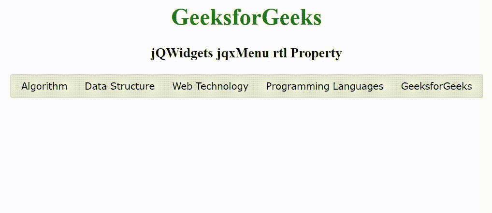

# jQWidgets jqxMenu rtl 性质

> 原文:[https://www . geeksforgeeks . org/jqwidgets-jqxmenu-RTL-property/](https://www.geeksforgeeks.org/jqwidgets-jqxmenu-rtl-property/)

jQWidgets 是一个 JavaScript 框架，用于为 PC 和移动设备制作基于 web 的应用程序。它是一个非常强大、优化、独立于平台并且得到广泛支持的框架。jqxMenu 代表一个 jQuery 菜单小部件，用于为网站或 web 应用程序创建菜单。jqxMenu 小部件可以用来创建网站菜单、定制的上下文菜单或应用程序风格的菜单栏，只需少量的脚本。

**rtl 属性**用于设置或返回一个值，该值指示小部件的元素是否对齐以支持使用从右向左字体的区域设置。它接受布尔类型值，默认值为 false。

**语法:**

设置 rtl 属性。

```
$('selector').jqxMenu({ rtl: Boolean });
```

归还 rtl 的财产。

```
var rtl = $('selector').jqxMenu('rtl');
```

**链接文件:**从给定的链接 https://www.jqwidgets.com/download/.下载 jQWidgets 在 HTML 文件中，找到下载文件夹中的脚本文件。

> <link rel="”stylesheet”" href="”jqwidgets/styles/jqx.base.css”" type="”text/css”">
> <脚本类型= " text/JavaScript " src = " scripts/jquery-1 . 11 . 1 . min . js "></脚本类型>
> <脚本类型= " text/JavaScript " src = " jqwidgets/jqxcore . js "></脚本类型>
> <脚本类型= " text/JavaScript " src = " jqwidgets/jqx-all . js

下面的例子说明了 jQWidgets jqxMenu rtl 属性。

**示例:**

## 超文本标记语言

```
<!DOCTYPE html>
<html lang="en">

<head>
    <link rel="stylesheet" href=
    "jqwidgets/styles/jqx.base.css" type="text/css" />
    <script type="text/javascript" 
        src="scripts/jquery-1.11.1.min.js"></script>
    <script type="text/javascript" 
        src="jqwidgets/jqxcore.js"></script>
    <script type="text/javascript" 
        src="jqwidgets/jqx-all.js"></script>
    <script type="text/javascript" 
        src="jqwidgets/jqxmenu.js"></script>

    <style>
        h1,
        h3 {
            text-align: center;
        }

        #jqxMenu {
            width: 100%;
            margin: 0 auto;
        }
    </style>
</head>

<body>
    <h1 style="color: green;">
        GeeksforGeeks
    </h1>

    <h3>
        jQWidgets jqxMenu rtl Property
    </h3>

    <div id='jqxWidget'>
        <div id='jqxMenu'>
            <ul>
                <li><a href="#">GeeksforGeeks</a></li>
                <li>Programming Languages
                    <ul>
                        <li><a href="#">C</a></li>
                        <li><a href="#">C++</a></li>
                        <li><a href="#">Java</a></li>
                        <li><a href="#">Python</a></li>
                        <li><a href="#">C#</a></li>
                    </ul>
                </li>
                <li>Web Technology
                    <ul>
                        <li><a href="#">Frontend</a>
                            <ul>
                                <li><a href="#">HTML</a></li>
                                <li><a href="#">CSS</a></li>
                                <li><a href="#">JavaScript</a></li>
                                <li><a href="#">ReactJS</a></li>
                            </ul>
                        </li>
                        <li><a href="#">Backend</a>
                            <ul>
                                <li><a href="#">PHP</a></li>
                                <li><a href="#">Node.js</a></li>
                            </ul>
                        </li>
                    </ul>
                </li>
                <li><a href="#">Data Structure</a></li>
                <li><a href="#">Algorithm</a></li>
            </ul>
        </div>
    </div>

    <script type="text/javascript">
        $(document).ready(function() {
            $("#jqxMenu").jqxMenu({
                width: '650',
                rtl: true
            });
        });
    </script>
</body>

</html
```

**输出:**



**参考:**[https://www . jqwidgets . com/jquery-widgets-documentation/documentation/jqxmenu/jquery-menu-API . htm](https://www.jqwidgets.com/jquery-widgets-documentation/documentation/jqxmenu/jquery-menu-api.htm)