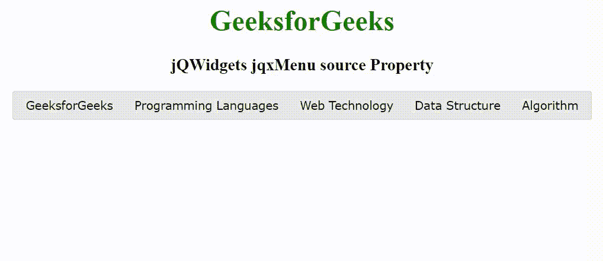

# jQWidgets jqxMenu 源属性

> 原文:[https://www . geesforgeks . org/jqwidgets-jqxmenu-source-property/](https://www.geeksforgeeks.org/jqwidgets-jqxmenu-source-property/)

jQWidgets 是一个 JavaScript 框架，用于为 PC 和移动设备制作基于 web 的应用程序。它是一个非常强大、优化、独立于平台并且得到广泛支持的框架。jqxMenu 代表一个 jQuery 菜单小部件，用于为网站或 web 应用程序创建菜单。jqxMenu 小部件可以用来创建网站菜单、定制的上下文菜单或应用程序风格的菜单栏，只需少量的脚本。

**源属性**用于设置或返回数据的来源。它接受对象类型值，默认值为空。

该属性中使用的项目字段有–

*   **标签–**指定物品的标签。
*   **值–**指定项目的值。
*   **html–**指定 html 项。要在项目中显示的 html。
*   **id–**指定物品的 id。
*   **项目–**指定子项目的数组。
*   **子菜单宽度–**指定子菜单的宽度。
*   **禁用–**指定项目是否启用/禁用。

**语法:**

设置源属性。

```
$('selector').jqxMenu({ source: Object });
```

**链接文件:**从给定的链接 https://www.jqwidgets.com/download/.下载 jQWidgets 在 HTML 文件中，找到下载文件夹中的脚本文件。

> <link rel="”stylesheet”" href="”jqwidgets/styles/jqx.base.css”" type="”text/css”">
> <脚本类型= " text/JavaScript " src = " scripts/jquery-1 . 11 . 1 . min . js "></脚本类型>
> <脚本类型= " text/JavaScript " src = " jqwidgets/jqxcore . js "></脚本类型>
> <脚本类型= " text/JavaScript " src = " jqwidgets/jqx-all . js

下面的示例说明了 jQWidgets jqxMenu 源属性。

**示例:**

## 超文本标记语言

```
<!DOCTYPE html>
<html lang="en">

<head>
    <link rel="stylesheet" href=
    "jqwidgets/styles/jqx.base.css" type="text/css" />
    <script type="text/javascript" 
        src="scripts/jquery-1.11.1.min.js"></script>
    <script type="text/javascript" 
        src="jqwidgets/jqxcore.js"></script>
    <script type="text/javascript" 
        src="jqwidgets/jqx-all.js"></script>
    <script type="text/javascript" 
        src="jqwidgets/jqxmenu.js"></script>

    <style>
        h1,
        h3 {
            text-align: center;
        }

        #jqxMenu {
            width: 100%;
            margin: 0 auto;
        }
    </style>
</head>

<body>
    <h1 style="color: green;">
        GeeksforGeeks
    </h1>

    <h3>
        jQWidgets jqxMenu source Property
    </h3>

    <div id='jqxMenu'></div>

    <script type="text/javascript">
        $(document).ready(function() {
            var source = [{
                label: 'GeeksforGeeks'
            }, {
                label: 'Programming Languages',
            }, {
                label: 'Web Technology',
            }, {
                label: 'Data Structure'
            }, {
                label: 'Algorithm'
            }]

            $("#jqxMenu").jqxMenu({
                source: source,
                width: '650'
            });
        });
    </script>
</body>

</html
```

**输出:**



**参考:**[https://www . jqwidgets . com/jquery-widgets-documentation/documentation/jqxmenu/jquery-menu-API . htm](https://www.jqwidgets.com/jquery-widgets-documentation/documentation/jqxmenu/jquery-menu-api.htm)