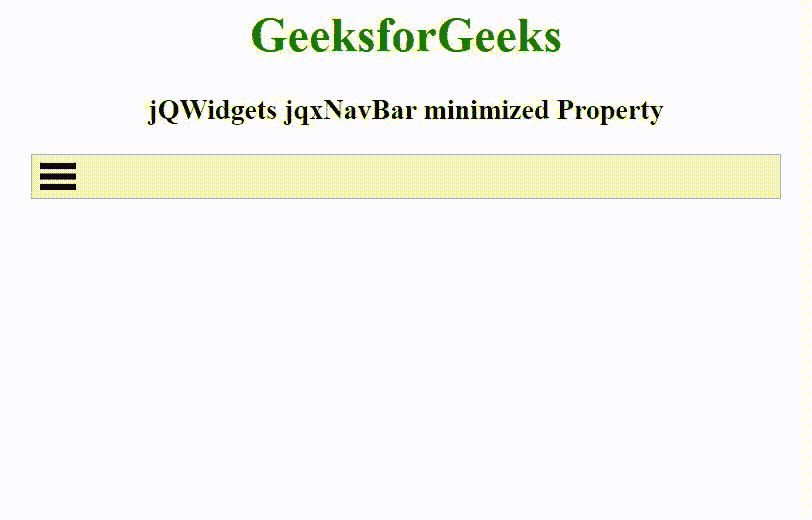

# jQWidgets jqxNavBar 最小化属性

> 原文:[https://www . geesforgeks . org/jqwidgets-jqxnavbar-mini 化-property/](https://www.geeksforgeeks.org/jqwidgets-jqxnavbar-minimized-property/)

jQWidgets 是一个 JavaScript 框架，用于为 PC 和移动设备制作基于 web 的应用程序。它是一个非常强大、优化、独立于平台并且得到广泛支持的框架。jqxNavBar 表示由

*   JQuery navigation bar widget built by tag. This widget is used to create simple or responsive horizontal/vertical navigation menu layouts.

**最小化属性**用于检查导航工具栏小部件是否最小化。它接受布尔类型值，默认值为 false。

**语法:**

设置最小化属性。

```html
$('selector').jqxNavBar({ minimized: Boolean });
```

返回最小化属性。

```html
var minimized = $('selector').jqxNavBar('minimized');
```

**链接文件:**从给定的链接 https://www.jqwidgets.com/download/.下载 jQWidgets 在 HTML 文件中，找到下载文件夹中的脚本文件。

> <link rel="”stylesheet”" href="”jqwidgets/styles/jqx.base.css”" type="”text/css”">
> <脚本类型= " text/JavaScript " src = " scripts/jquery-1 . 11 . 1 . min . js "></脚本类型>
> <脚本类型= " text/JavaScript " src = " jqwidgets/jqxcore . js "></脚本类型>
> <脚本类型= " text/JavaScript " src = " jqwidgets/jqx-all . js

下面的例子说明了 jQWidgets jqxNavBar 最小化属性。

**示例:**

## 超文本标记语言

```html
<!DOCTYPE html>
<html lang="en">

<head>
    <link rel="stylesheet" href=
    "jqwidgets/styles/jqx.base.css" type="text/css" />
    <script type="text/javascript" 
        src="scripts/jquery-1.11.1.min.js"></script>
    <script type="text/javascript" 
        src="jqwidgets/jqxcore.js"></script>
    <script type="text/javascript" 
        src="jqwidgets/jqx-all.js"></script>
    <script type="text/javascript" 
        src="jqwidgets/jqxnavbar.js"></script>

    <style>
        h1,
        h3 {
            text-align: center;
        }

        #navBar {
            width: 100%;
            margin: 0 auto;
        }
    </style>
</head>

<body>
    <h1 style="color: green;">
        GeeksforGeeks
    </h1>

    <h3>
        jQWidgets jqxNavBar minimized Property
    </h3>

    <div id="navBar">
        <ul>
            <li>GeeksforGeeks</li>
            <li>Data Structure</li>
            <li>Algorithm</li>
            <li>Web Technology</li>
            <li>Programming</li>
        </ul>
    </div>

    <script type="text/javascript">
        $(document).ready(function() {
            $("#navBar").jqxNavBar({ 
                height: 200,
                width: 500,
                minimized: true,
                orientation: 'vertical',
                selectedItem: 0 
            });
        });
    </script>
</body>

</html>
```

**输出:**



**参考:**[https://www . jqwidgets . com/jquery-widgets-documentation/documentation/jqxnavbar/jquery-navbar-API . htm](https://www.jqwidgets.com/jquery-widgets-documentation/documentation/jqxnavbar/jquery-navbar-api.htm)