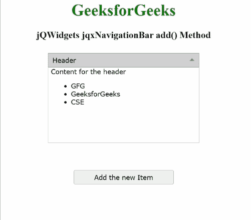

# jQWidgets jqxNavigationBar add()方法

> 原文:[https://www . geesforgeks . org/jqwidgets-jqxnavigationbar-add-method/](https://www.geeksforgeeks.org/jqwidgets-jqxnavigationbar-add-method/)

**jQWidgets** 是一个 JavaScript 框架，用于为 PC 和移动设备制作基于 web 的应用程序。它是一个非常强大、优化、独立于平台并且得到广泛支持的框架。 **jqxNavigationBar** 用于表示包含标题和内容部分的 jQuery 小部件。单击标题，内容将相应地展开或折叠。

**add()** **方法**用于在指定的 jqxNavigationBar 底部插入一个新项目。

**语法:**

```html
$('#jqxNavigationBar').jqxNavigationBar(
    'add', 'Header', 'Content');
```

**参数:**该方法接受两个参数，如下图所示:

*   **表头:**这是新增项目的表头。
*   **内容:**这是新增项的内容。

**返回值:**此方法不返回值。

**链接文件:**从给定链接下载 [jQWidgets](https://www.jqwidgets.com/download/) 。在 HTML 文件中，找到下载文件夹中的脚本文件。

> <link rel="”stylesheet”" href="”jqwidgets/styles/jqx.base.css”" type="”text/css”">
> <脚本类型=“text/JavaScript”src =“scripts/jquery . js”></脚本>
> <脚本类型=“text/JavaScript”src =“jqwidgets/jqxcore . js”></脚本>
> <脚本类型=“text/JavaScript”src =“jqwidgets/jqxexpander . js”><

**示例:**下面的示例说明了 jQWidgets jqxNavigationBar**add()**方法。

## 超文本标记语言

```html
<!DOCTYPE html>
<html lang="en">

<head>
    <link rel="stylesheet" 
          href="jqwidgets/styles/jqx.base.css"
          type="text/css"/>
    <script type="text/javascript" 
            src="scripts/jquery.js">
    </script>
    <script type="text/javascript" 
            src="jqwidgets/jqxcore.js">
    </script>
    <script type="text/javascript" 
            src="jqwidgets/jqxexpander.js">
    </script>
    <script type="text/javascript" 
            src="jqwidgets/jqxnavigationbar.js">
    </script>
</head>

<body>
    <center>
        <h1 style="color: green;">
            GeeksforGeeks
        </h1>
        <h3>
            jQWidgets jqxNavigationBar add() Method
        </h3>
        <div id="jqx_Navigation_Bar"
             style="margin: 25px;" 
             align="left">
            <div>Header</div>
            <div>
                <h8>Content for the header</h8>
                <ul>
                    <li>GFG</li>
                    <li>GeeksforGeeks</li>
                    <li>CSE</li>
                </ul>
            </div>
        </div>
        <input type="button" style="margin: 29px;" 
               id="jqxbutton_for_add" 
               value="Add the new Item"/>
        <script type="text/javascript">
            $(document).ready(function () {
                $("#jqx_Navigation_Bar").
                jqxNavigationBar({
                    width: 290,
                    height: 180,
                });
                $("#jqxbutton_for_add").jqxButton({
                    width: 200,
                });
                $('#jqxbutton_for_add').on(
                  'click', function () {
                    var Header = 'New header';
                    var Content = 'Content for the new header';
                    $('#jqx_Navigation_Bar').jqxNavigationBar(
                      'add', Header, Content);
                });
            });
        </script>
    </center>
</body>

</html>
```

**输出:**



**参考:**[https://www . jqwidgets . com/jquery-widgets-documentation/documentation/jqxnavigationbar/jquery-navigationbar-API . htm](https://www.jqwidgets.com/jquery-widgets-documentation/documentation/jqxnavigationbar/jquery-navigationbar-api.htm)