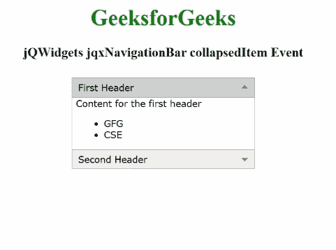

# jqwidgets jqxn 导航崩溃事件

> 原文:[https://www . geesforgeks . org/jqwidgets-jqxnavigationbar-collapseditem-event/](https://www.geeksforgeeks.org/jqwidgets-jqxnavigationbar-collapseditem-event/)

**jQWidgets****是一个为 PC 和移动设备制作基于 web 的应用的 JavaScript 框架。它是一个非常强大、优化、独立于平台并且得到广泛支持的框架。**jqxNavigationBar****用于表示一个包含标题和内容部分的 jQuery 小部件。单击标题，内容将相应地展开或折叠。****

****当指定 jqxNavigationBar 的一个项目折叠时，触发**折叠项**事件。****

******语法:******

```html
**$('Selector').on('collapsedItem', function (event) {
    var collapsedItem = event.args.item;
});**
```

******链接文件:**从给定链接下载 [jQWidgets](https://www.jqwidgets.com/download/) 。在 HTML 文件中，找到下载文件夹中的脚本文件。****

> <link rel="”stylesheet”" href="”jqwidgets/styles/jqx.base.css”" type="”text/css”"> ****<脚本类型=“text/JavaScript”src =“scripts/jquery . js”></脚本>
> <脚本类型=“text/JavaScript”src =“jqwidgets/jqxcore . js”></脚本>
> <脚本类型=“text/JavaScript”src =“jqwidgets/jqxexpander . js”><****

******示例:**下面的示例说明了 jQWidgets jqxNavigationBar**collapsedItem**事件。****

## ****超文本标记语言****

```html
**<!DOCTYPE html>
<html lang="en">

<head>
    <link rel="stylesheet" 
          href="jqwidgets/styles/jqx.base.css" 
          type="text/css"/>
    <script type="text/javascript" 
            src="scripts/jquery.js">
    </script>
    <script type="text/javascript" 
            src="jqwidgets/jqxcore.js">
    </script>
    <script type="text/javascript" 
            src="jqwidgets/jqxexpander.js">
    </script>
    <script type="text/javascript" 
            src="jqwidgets/jqxnavigationbar.js">
    </script>
</head>

<body>
    <center>
        <h1 style="color: green;">
            GeeksforGeeks
        </h1>
        <h3>
            jQWidgets jqxNavigationBar collapsedItem Event
        </h3>
        <div id="jqx_Navigation_Bar" 
             style="margin: 25px;" 
             align="left">
            <div>First Header</div>
            <div>
                <h8>Content for the first header</h8>
                <ul>
                    <li>GFG</li>
                    <li>CSE</li>
                </ul>
            </div>
            <div> Second Header</div>
            <div>
                <h8>Content for the second header</h8>
                <ul>
                    <li>GeeksforGeeks</li>
                    <li>CSE</li>
                </ul>
            </div>
        </div>
        <div id="log"></div>
        <script type="text/javascript">
            $(document).ready(function () {
                $("#jqx_Navigation_Bar").
                    jqxNavigationBar({
                        width: 250,
                        height: 132
                    });
                $('#jqx_Navigation_Bar').
                    on('collapsedItem', function (event) {
                        var Collapsed_Item = event.args.item;
                        $("#log").html(JSON.stringify(
                     "The index of the collapsed item is: "
                            + Collapsed_Item))
                    });
            });
        </script>
    </center>
</body>

</html>**
```

******输出:******

********

******参考:**[https://www . jqwidgets . com/jquery-widgets-documentation/documentation/jqxnavigationbar/jquery-navigationbar-API . htm](https://www.jqwidgets.com/jquery-widgets-documentation/documentation/jqxnavigationbar/jquery-navigationbar-api.htm)****