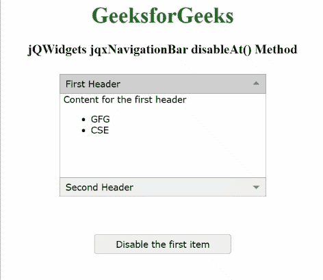

# jQWidgets jqxNavigationBar disablet()方法

> 原文:[https://www . geesforgeks . org/jqwidgets-jqxnavigationbar-disablet-method/](https://www.geeksforgeeks.org/jqwidgets-jqxnavigationbar-disableat-method/)

**jQWidgets** 是一个 JavaScript 框架，用于为 PC 和移动设备制作基于 web 的应用程序。它是一个非常强大、优化、独立于平台并且得到广泛支持的框架。 **jqxNavigationBar** 用于表示包含标题和内容部分的 jQuery 小部件。单击标题，内容将相应地展开或折叠。

**disablet()**方法用于使用指定的项目索引禁用指定的 **jqxNavigationBar** 的项目。

**语法:**

```
$('#jqxNavigationBar').jqxNavigationBar('disableAt', Index);
```

**参数:**该方法接受如下所示的参数:

*   **索引:**这是将要禁用的项目的索引。

**返回值:**此方法不返回值。

**链接文件:**从给定链接下载https://www.jqwidgets.com/download/。在 HTML 文件中，找到下载文件夹中的脚本文件。

> <link rel="”stylesheet”" href="”jqwidgets/styles/jqx.base.css”" type="”text/css”">
> <脚本类型=“text/JavaScript”src =“scripts/jquery . js”></脚本>
> <脚本类型=“text/JavaScript”src =“jqwidgets/jqxcore . js”></脚本>
> <脚本类型=“text/JavaScript”src =“jqwidgets/jqxexpander . js”><

**示例:**下面的示例说明了 jQWidgets jqxNavigationBar**disablet()****方法。在下面的示例中，第 0 行索引处的项目将被禁用。**

## **超文本标记语言**

```
<!DOCTYPE html>
<html lang="en">

<head>
    <link rel="stylesheet" href="
    jqwidgets/styles/jqx.base.css" type="text/css" />
    <script type="text/javascript" 
       src="scripts/jquery.js"> </script>
    <script type="text/javascript" 
       src="jqwidgets/jqxcore.js"> </script>
    <script type="text/javascript"
       src="jqwidgets/jqxexpander.js"> </script>
    <script type="text/javascript" 
       src="jqwidgets/jqxnavigationbar.js"> </script>
    <script type="text/javascript" 
       src="jqwidgets/jqx-all.js"> </script>   
</head>

<body>
    <center>
        <h1 style="color: green;">
            GeeksforGeeks
        </h1>

        <h3>
            jQWidgets jqxNavigationBar disableAt() Method
        </h3>

        <div id="jqx_Navigation_Bar" style="margin: 25px;"
              align="left">

            <div>First Header</div>
            <div>
                <h8>Content for the first header</h8>
                <ul>
                    <li>GFG</li>
                    <li>CSE</li>
                </ul>
            </div>

            <div> Second Header</div>
            <div>
                <h8>Content for the second header</h8>
                <ul>
                    <li>GeeksforGeeks</li>
                    <li>CSE</li>
                </ul>
            </div>

        </div>

        <input type="button" style="margin: 29px;" 
               id="jqxbutton_for_disableAt" 
               value="Disable the first item" />

        <script type="text/javascript">

            $(document).ready(function () {
                $("#jqx_Navigation_Bar").
                    jqxNavigationBar({
                        width: 290,
                        height: 180,
                    });

                $("#jqxbutton_for_disableAt").jqxButton({
                    width: 200,
                });
                $('#jqxbutton_for_disableAt').on(
                    'click', function () {
                        var Item_Index = 0;
                        $('#jqx_Navigation_Bar').
                            jqxNavigationBar(
                                'disableAt', Item_Index);
                    });
            });
        </script>
    </center>
</body>

</html>
```

****输出:****

****

****参考:**[https://www . jqwidgets . com/jquery-widgets-documentation/documentation/jqxnavigationbar/jquery-navigationbar-API . htm？搜索=](https://www.jqwidgets.com/jquery-widgets-documentation/documentation/jqxnavigationbar/jquery-navigationbar-api.htm?search=)**