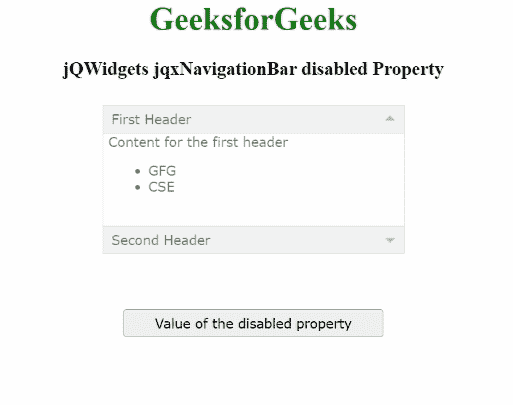

# jQWidgets jqxNavigationBar 禁用属性

> 原文:[https://www . geesforgeks . org/jqwidgets-jqxnavigationbar-disabled-property/](https://www.geeksforgeeks.org/jqwidgets-jqxnavigationbar-disabled-property/)

***jQWidgets*** 是一个 JavaScript 框架，用于为 PC 和移动设备制作基于 web 的应用程序。它是一个非常强大、优化、独立于平台并且得到广泛支持的框架。 ***jqxNavigationBar*** 用于表示具有标题和内容部分的 jQuery 小部件。单击标题，内容将相应地展开或折叠。

***禁用*** 属性用于设置或返回指定导航栏是否禁用。此属性接受布尔值“真”或“假”。

**语法:**

对于设置 ***禁用*** 属性:

```html
$('Selector').jqxNavigationBar({ disabled:true });  
```

获取 ***禁用*** 属性:

```html
var disabled = 
    $('Selector').jqxNavigationBar('disabled');
```

**链接文件:**从给定链接下载 [jQWidgets](https://www.jqwidgets.com/download/) 。在 HTML 文件中，找到下载文件夹中的脚本文件。

> <link rel="”stylesheet”" href="”jqwidgets/styles/jqx.base.css”" type="”text/css”">
> <脚本类型=“text/JavaScript”src =“scripts/jquery . js”></脚本>
> <脚本类型=“text/JavaScript”src =“jqwidgets/jqxcore . js”></脚本>
> <脚本类型=“text/JavaScript”src =“jqwidgets/jqxexpander . js”><

**示例:**以下示例说明了 jQWidgets jqxNavigationBar***禁用*** 属性。在以下示例中， ***禁用*** 属性的值已设置为真。

## 超文本标记语言

```html
<!DOCTYPE html>
<html lang="en">

<head>
    <link rel="stylesheet" href=
    "jqwidgets/styles/jqx.base.css" type="text/css"/>
    <script type="text/javascript" 
            src="scripts/jquery.js">
    </script>
    <script type="text/javascript" 
            src="jqwidgets/jqxcore.js">
    </script>
    <script type="text/javascript" 
            src="jqwidgets/jqxexpander.js">
    </script>
    <script type="text/javascript" 
            src="jqwidgets/jqxnavigationbar.js">
    </script>
</head>

<body>
    <center>
        <h1 style="color: green;">
            GeeksforGeeks
        </h1>
        <h3>
            jQWidgets jqxNavigationBar disabled Property
        </h3>
        <div id="jqx_Navigation_Bar" style="margin: 25px;" 
             align="left">
            <div>First Header</div>
            <div>
                <h8>Content for the first header</h8>
                <ul>
                    <li>GFG</li>
                    <li>CSE</li>
                </ul>
            </div>
            <div> Second Header</div>
            <div>
                <h8>Content for the second header</h8>
                <ul>
                    <li>GeeksforGeeks</li>
                    <li>CSE</li>
                </ul>
            </div>
        </div>
        <input type="button" style="margin: 29px;" 
               id="jqxbutton_for_disabled" 
               value="Value of the disabled property"/>
        <div id="log"></div>
        <script type="text/javascript">
            $(document).ready(function () {
                $("#jqx_Navigation_Bar").
                    jqxNavigationBar({
                        width: 290,
                        height: 150,
                        disabled: 'true'
                    });
                $("#jqxbutton_for_disabled").
                    jqxButton({
                        width: 260,
                    });
                $('#jqxbutton_for_disabled').
                    on('click', function () {
                        var value_of_disabled =
                            $('#jqx_Navigation_Bar').
                                jqxNavigationBar(
                                    'disabled');
                        $("#log").html(JSON.stringify(
                            value_of_disabled))
                    });
            });
        </script>
    </center>
</body>

</html>
```

**输出:**



**参考:**[https://www . jqwidgets . com/jquery-widgets-documentation/documentation/jqxnavigationbar/jquery-navigationbar-API . htm？搜索=](https://www.jqwidgets.com/jquery-widgets-documentation/documentation/jqxnavigationbar/jquery-navigationbar-api.htm?search=)