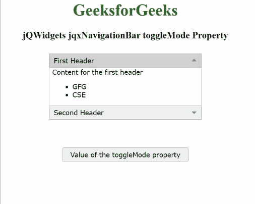

# jQWidgets jqxNavigationBar toggle mode 属性

> 原文:[https://www . geesforgeks . org/jqwidgets-jqxnavigationbar-toggle mode-property/](https://www.geeksforgeeks.org/jqwidgets-jqxnavigationbar-togglemode-property/)

**jQWidgets** 是一个 JavaScript 框架，用于为 PC 和移动设备制作基于 web 的应用程序。它是一个非常强大、优化、独立于平台并且得到广泛支持的框架。 **jqxNavigationBar** 用于表示包含标题和内容部分的 jQuery 小部件。单击标题，内容将相应地展开或折叠。

**toggle mode****属性用于设置或获取用于展开或折叠指定 jqxNavigationBar 内容的用户交互。此属性接受三个可能的值，即“单击”、“dblclick”和“无”。**

****语法:****

*   **要设置*切换模式*属性:**

    ```html
    $('Selector').jqxNavigationBar({ 
        toggleMode: "dblclick" 
    }); 
    ```

*   **获取*至*属性:**

    ```html
    var toggleMode = 
        $('Selector').jqxNavigationBar('toggleMode');
    ```

****链接文件:**从给定链接下载 [jQWidgets](https://www.jqwidgets.com/download/) 。在 HTML 文件中，找到下载文件夹中的脚本文件。**

> <link rel="”stylesheet”" href="”jqwidgets/styles/jqx.base.css”" type="”text/css”"> **<脚本类型=“text/JavaScript”src =“scripts/jquery . js”></脚本>
> <脚本类型=“text/JavaScript”src =“jqwidgets/jqxcore . js”></脚本>
> <脚本类型=“text/JavaScript”src =“jqwidgets/jqxexpander . js”><**

****示例:**下面的示例说明了 jQWidgets jqxNavigationBar**toggle mode**T4 属性。在下面的例子中， ***toggleMode*** 属性的值被设置为“dblclick”。**

## **超文本标记语言**

```html
<!DOCTYPE html>
<html lang="en">

<head>
    <link rel="stylesheet" 
          href="jqwidgets/styles/jqx.base.css" 
          type="text/css"/>
    <script type="text/javascript" 
            src="scripts/jquery.js">
    </script>
    <script type="text/javascript" 
            src="jqwidgets/jqxcore.js">
    </script>
    <script type="text/javascript" 
            src="jqwidgets/jqxexpander.js">
    </script>
    <script type="text/javascript" 
            src="jqwidgets/jqxnavigationbar.js">
    </script>
</head>

<body>
    <center>
        <h1 style="color: green;">
            GeeksforGeeks
        </h1>
        <h3>
            jQWidgets jqxNavigationBar toggleMode Property
        </h3>
        <div id="jqx_Navigation_Bar" 
             style="margin: 25px;" 
             align="left">
            <div>First Header</div>
            <div>
                <h8>Content for the first header</h8>
                <ul>
                    <li>GFG</li>
                    <li>CSE</li>
                </ul>
            </div>
            <div> Second Header</div>
            <div>
                <h8>Content for the second header</h8>
                <ul>
                    <li>GeeksforGeeks</li>
                    <li>CSE</li>
                </ul>
            </div>
        </div>
        <input type="button" style="margin: 29px;" 
               id="jqxbutton_for_toggleMode"
            value="Value of the toggleMode property"/>
        <div id="log"></div>
        <script type="text/javascript">
            $(document).ready(function () {
                $("#jqx_Navigation_Bar").
                    jqxNavigationBar({
                        width: 290,
                        height: 132,
                        toggleMode: 'dblclick'
                    });
                $("#jqxbutton_for_toggleMode").
                    jqxButton({
                        width: 250,
                    });
                $('#jqxbutton_for_toggleMode').
                    on('click', function () {
                        var value_of_toggleMode =
                            $('#jqx_Navigation_Bar').
                                jqxNavigationBar(
                                    'toggleMode');
                        $("#log").html(JSON.stringify(
                            value_of_toggleMode))
                    });
            });
        </script>
    </center>
</body>

</html>
```

****输出:****

****

****参考:**[https://www . jqwidgets . com/jquery-widgets-documentation/documentation/jqxnavigationbar/jquery-navigationbar-API . htm](https://www.jqwidgets.com/jquery-widgets-documentation/documentation/jqxnavigationbar/jquery-navigationbar-api.htm)**