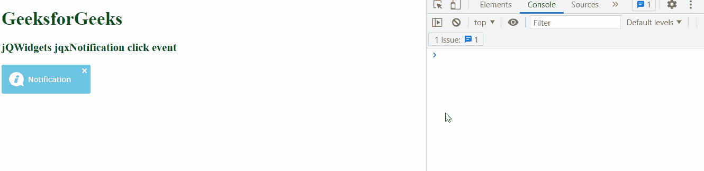

# jQWidgets jqxNotification 点击事件

> 原文:[https://www . geesforgeks . org/jqwidgets-jqxnotification-click-event/](https://www.geeksforgeeks.org/jqwidgets-jqxnotification-click-event/)

**jQWidgets** 是一个 JavaScript 框架，用于为 PC 和移动设备制作基于 web 的应用程序。它是一个非常强大、优化、独立于平台并且得到广泛支持的框架。 **jqxNotification** 代表一个 jQuery 小部件，可以用来向用户显示一些通知内容。可以根据用户需求进行修改。

当点击通知时，触发**点击**事件。

**语法:**

```
$('#jqxNotification').on('click', function () {
     // Code
});  
```

**链接文件:**从链接下载 [jQWidgets](https://www.jqwidgets.com/download/) 。在 HTML 文件中，找到下载文件夹中的脚本文件。

> <link rel="”stylesheet”" href="”jqwidgets/styles/jqx.base.css”" type="”text/css”">
> <脚本类型=【文本/JavaScript】src =【脚本/jquery-1 . 11 . 1 . min . js】></脚本>
> T8】脚本类型=【文本/JavaScript】src =【jqwidgets/jqxcore . js】></脚本>
> T12】脚本类型=【文本/JavaScript】src =【jqwidgets/jqxnotification . js】

**示例:**以下示例说明了 jQWidgets 中的 jqxNotification **点击**事件。

## 超文本标记语言

```
<!DOCTYPE html>
<html lang="en">

<head>
    <link rel="stylesheet" href=
    "jqwidgets/styles/jqx.base.css" type="text/css" />
    <script type="text/javascript" 
        src="scripts/jquery-1.11.1.min.js"></script>
    <script type="text/javascript" 
        src="jqwidgets/jqxcore.js"></script>
    <script type="text/javascript" 
        src="jqwidgets/jqxnotification.js"></script>
</head>

<body>
    <h1 style="color:green">
        GeeksforGeeks
    </h1>

    <h3>jQWidgets jqxNotification click event</h3>

    <div id="not">
        Notification
    </div>

    <script type="text/javascript">
        $(document).ready(function () {
            $("#not").jqxNotification({
                autoOpen: true,
                position: 'center'
            });
        });

        $('#not').on('click', function () {
            console.log('the notification is clicked');
        });
    </script>
</body>

</html>
```

**输出:**



**参考:**[**https://www . jqwidgets . com/jquery-widgets-documentation/documentation/jqxnotification/jquery-notification-API . htm？搜索=**](https://www.jqwidgets.com/jquery-widgets-documentation/documentation/jqxnotification/jquery-notification-api.htm?search=)