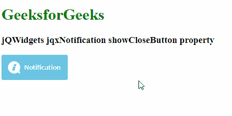

# jQWidgets jqxNotification showCloseButton 属性

> 原文:[https://www . geesforgeks . org/jqwidgets-jqxnotification-showclosebutton-property/](https://www.geeksforgeeks.org/jqwidgets-jqxnotification-showclosebutton-property/)

**QWidgets** 是一个 JavaScript 框架，用于为 PC 和移动设备制作基于 web 的应用程序。它是一个非常强大和优化的框架，独立于平台，并得到广泛支持。 **jqxNotification** 代表一个 jQuery 小部件，可以用来向用户显示一些通知内容。jqxNotification 小部件内容可以根据用户需求进行修改。

**显示关闭按钮属性**用于设置或返回显示关闭按钮属性。即该属性用于设置或返回是否显示关闭按钮。它接受布尔类型值，默认值为真。

**语法:**

设置 showCloseButton 属性。

```html
$('Selector').jqxNotification({ showCloseButton : boolean});
```

返回 showCloseButton 属性。

```html
var showCloseButton = 
    $('Selector').jqxNotification('showCloseButton ');
```

**链接文件:**从链接下载 [jQWidgets](https://www.jqwidgets.com/download/) 。在 HTML 文件中，找到下载文件夹中的脚本文件:

> <link rel="”stylesheet”" href="”jqwidgets/styles/jqx.base.css”" type="”text/css”">
> <脚本类型=【文本/JavaScript】src =【脚本/jquery-1 . 11 . 1 . min . js】></脚本>
> T8】脚本类型=【文本/JavaScript】src =【jqwidgets/jqxcore . js】></脚本>
> T12】脚本类型=【文本/JavaScript】src =【jqwidgets/jqxnotification . js】

**示例:**以下示例说明了 jQWidgets 中的 jqxNotification showCloseButton 属性:

## 超文本标记语言

```html
<!DOCTYPE html>
<html lang="en">

<head>
    <link rel="stylesheet" href=
    "jqwidgets/styles/jqx.base.css" type="text/css" />
    <script type="text/javascript" 
        src="scripts/jquery-1.11.1.min.js"></script>
    <script type="text/javascript" 
        src="jqwidgets/jqxcore.js"></script>
    <script type="text/javascript" 
        src="jqwidgets/jqxnotification.js"></script>
</head>

<body>
    <h1 style="color: green">
        GeeksforGeeks
    </h1>

    <h3>
        jQWidgets jqxNotification 
        showCloseButton property
    </h3>

    <div id="not">
        Notification
    </div>

    <script type="text/javascript">
        $(document).ready(function () {
            $("#not").jqxNotification({
                position: "top-left",
                opacity: 0.9,
                autoOpen: true,
                autoClose: false,
                showCloseButton: false,
                template: "info",
                position: 'center'
            });
        });
    </script>
</body>

</html>
```

**输出:**



**参考:**[https://www . jqwidgets . com/jquery-widgets-documentation/documentation/jqxnotification/jquery-notification-API . htm？搜索=](https://www.jqwidgets.com/jquery-widgets-documentation/documentation/jqxnotification/jquery-notification-api.htm?search=)