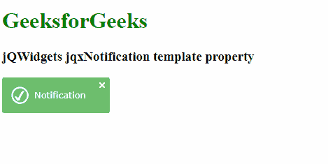

# jQWidgets jqxNotification 模板属性

> 原文:[https://www . geesforgeks . org/jqwidgets-jqxnotification-template-property/](https://www.geeksforgeeks.org/jqwidgets-jqxnotification-template-property/)

**jQWidgets** 是一个 JavaScript 框架，用于为 PC 和移动设备制作基于 web 的应用程序。它是一个非常强大和优化的框架，独立于平台，并得到广泛支持。 **jqxNotification** 代表一个 jQuery 小部件，可以用来向用户显示一些通知内容。jqxNotification 小部件内容可以根据用户需求进行修改。

**模板属性**用于设置或返回模板属性。即该属性用于设置或返回通知模板。它接受字符串类型值，默认值为“info”。

**其可能值如下。**

*   **“信息”:**通知的颜色为蓝色。
*   **【警告】:**通知颜色为橙色。
*   **“成功”:**通知的颜色为绿色。
*   **“错误”:**通知的颜色为红色。
*   **【邮件】:**通知的颜色为蓝色。
*   **“时间”:**通知的颜色为黑色。
*   **“空”:**通知的颜色为白色。

**语法:**

*   设置**模板**属性。

```
$('Selector').jqxNotification({ template : string });
```

*   返回**模板**属性。

```
var template = $('Selector').jqxNotification('template');
```

**链接文件:**从链接下载 https://www.jqwidgets.com/download/。在 HTML 文件中，找到下载文件夹中的脚本文件:

> <link rel="”stylesheet”" href="”jqwidgets/styles/jqx.base.css”" type="”text/css”">
> <脚本类型=【文本/JavaScript】src =【脚本/jquery-1 . 11 . 1 . min . js】></脚本>
> T8】脚本类型=【文本/JavaScript】src =【jqwidgets/jqxcore . js】></脚本>
> T12】脚本类型=【文本/JavaScript】src =【jqwidgets/jqxnotification . js】

**示例**:以下示例说明了 jQWidgets 中的 jqxNotification 模板属性:

## 超文本标记语言

```
<!DOCTYPE html>
<html lang="en">

<head>
    <link rel="stylesheet" 
          href="jqwidgets/styles/jqx.base.css"
          type="text/css" />
    <script type="text/javascript" 
            src="scripts/jquery-1.11.1.min.js">
    </script>
    <script type="text/javascript" 
            src="jqwidgets/jqxcore.js">
    </script>
    <script type="text/javascript" 
            src="jqwidgets/jqxnotification.js">
    </script>
</head>

<body>
    <h1 style="color: green">
          GeeksforGeeks
      </h1>

      <h3>jQWidgets jqxNotification template property</h3>

      <div id="not">
        Notification
    </div>

    <script type="text/javascript">
        $(document).ready(function () {
            $("#not").jqxNotification({
                position: "top-left",
                opacity: 0.9,
                autoOpen: true,
                autoClose: false,
                template: "success",
                position: 'center'
            });
        });
    </script>
</body>

</html>
```

**输出:**



**参考:**[https://www . jqwidgets . com/jquery-widgets-documentation/documentation/jqxnotification/jquery-notification-API . htm？搜索=](https://www.jqwidgets.com/jquery-widgets-documentation/documentation/jqxnotification/jquery-notification-api.htm?search=)