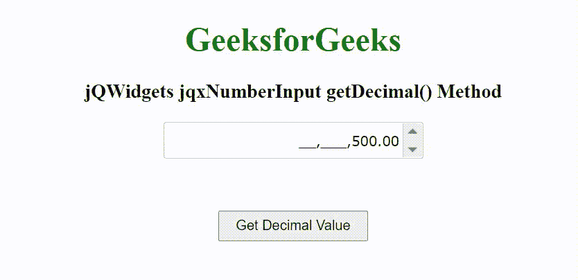

# jqwidgets jqxnombinput getdecimer()方法

> 原文:[https://www . geesforgeks . org/jqwidgets-jqxnumberinput-get decimal-method/](https://www.geeksforgeeks.org/jqwidgets-jqxnumberinput-getdecimal-method/)

**jQWidgets** 是一个 JavaScript 框架，用于为 PC 和移动设备制作基于 web 的应用程序。它是一个非常强大、优化、独立于平台并且得到广泛支持的框架。jqxNumberInput 表示一个 jQuery 小部件，用于添加输入货币、百分比和任何类型的数字数据。输入数据可以以各种方式呈现。这个小部件的其他功能是自定义数字和小数位数、货币符号的字符串和位置、组和小数分隔符。

**getDecimal()** 方法用于获取小部件的十进制值。它不接受任何参数，并返回十进制值。

**语法:**

```
$('Selector').jqxNumberInput('getDecimal');
```

**链接文件:**从给定链接下载 [jQWidgets](https://www.jqwidgets.com/download/) 。在 HTML 文件中，找到下载文件夹中的脚本文件。

> <link rel="”stylesheet”" href="”jqwidgets/styles/jqx.base.css”" type="”text/css”">
> <脚本类型= " text/JavaScript " src = " scripts/jquery-1 . 11 . 1 . min . js "></脚本类型>
> <脚本类型= " text/JavaScript " src = " jqwidgets/jqxcore . js "></脚本类型>
> <脚本类型= " text/JavaScript " src = " jqwidgets/jqx-all . js

**示例:**下面的示例说明了 jQWidgets jqxnumber input**getDecimal()**方法。

## 超文本标记语言

```
<!DOCTYPE html>
<html lang="en">

<head>
    <link rel="stylesheet" href=
        "jqwidgets/styles/jqx.base.css" type="text/css" />
    <script type="text/javascript" 
        src="scripts/jquery-1.11.1.min.js"></script>
    <script type="text/javascript" 
        src="jqwidgets/jqxcore.js"></script>
    <script type="text/javascript" 
        src="jqwidgets/jqx-all.js"></script>
    <script type="text/javascript" 
        src="jqwidgets/jqxnumberinput.js"></script>
</head>

<body>
    <center>
        <h1 style="color: green;">
            GeeksforGeeks
        </h1>

        <h3>
            jQWidgets jqxNumberInput getDecimal() Method
        </h3>

        <div id='jqxNumberInput'></div>

        <input type="button" id="jqxBtn" 
            value="Get Decimal Value" 
            style="padding: 5px 15px; margin-top: 50px;">
    </center>

    <script type="text/javascript">
        $(document).ready(function() {
            $("#jqxNumberInput").jqxNumberInput({
                width: '250px',
                height: '35px',
                spinButtons: true,
                value: 500
            });

            $("#jqxBtn").on('click', function() {
                var dec = $("#jqxNumberInput")
                    .jqxNumberInput('getDecimal');

                alert("Decimal Value: " + dec);
            });
        });
    </script>
</body>

</html>
```

**输出:**



**参考:**[https://www . jqwidgets . com/jquery-widgets-documentation/documentation/jqxnumber input/jquery-number-input-API . htm](https://www.jqwidgets.com/jquery-widgets-documentation/documentation/jqxnumberinput/jquery-number-input-api.htm)