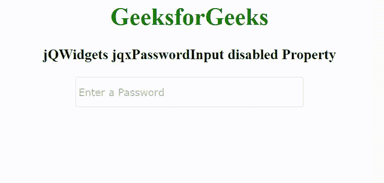

# jQWidgets jqxPasswordInput 禁用属性

> 原文:[https://www . geesforgeks . org/jqwidgets-jqxpasswordpinput-disabled-property/](https://www.geeksforgeeks.org/jqwidgets-jqxpasswordinput-disabled-property/)

**jQWidgets** 是一个 JavaScript 框架，用于为 PC 和移动设备制作基于 web 的应用程序。它是一个非常强大、优化、独立于平台并且得到广泛支持的框架。jqxPasswordInput 是一个 jQuery 小部件，它支持输入字段密码，并对密码的强度有很好的视觉反馈。

*禁用*属性用于设置或返回小部件是否被禁用。它接受布尔类型值，默认值为*假*。

**语法:**

设置*禁用*属性。

```html
$('selector').jqxPasswordInput({ disabled: Boolean });
```

返回*禁用的*属性。

```html
var disabled = $('selector').jqxPasswordInput('disabled');
```

**链接文件:**从链接下载 [jQWidgets](https://www.jqwidgets.com/download/) 。在 HTML 文件中，找到下载文件夹中的脚本文件。

> <link rel="”stylesheet”" href="”jqwidgets/styles/jqx.base.css”" type="”text/css”">
> <脚本类型= " text/JavaScript " src = " scripts/jquery-1 . 11 . 1 . min . js "></脚本类型>
> <脚本类型= " text/JavaScript " src = " jqwidgets/jqxcore . js "></脚本类型>
> <脚本类型= " text/JavaScript " src = " jqwidgets/jqx-all . js

**示例:**以下示例说明了 jQWidgets 中的 jqxPasswordInput *禁用了*属性。

## 超文本标记语言

```html
<!DOCTYPE html>
<html lang="en">

<head>
    <link rel="stylesheet" href=
        "jqwidgets/styles/jqx.base.css" type="text/css" />
    <script type="text/javascript" 
        src="scripts/jquery-1.11.1.min.js"></script>
    <script type="text/javascript" 
        src="jqwidgets/jqxcore.js"></script>
    <script type="text/javascript" 
        src="jqwidgets/jqxpasswordinput.js"></script>
</head>

<body>
    <center>
        <h1 style="color: green;">
            GeeksforGeeks
        </h1>

        <h3>
            jQWidgets jqxPasswordInput disabled Property
        </h3>

        <input type="password" id="input" />
    </center>

    <script type="text/javascript">
        $(document).ready(function() {
            $("#input").jqxPasswordInput({
                width: 300,
                height: 40,
                placeHolder: "Enter a Password",
                disabled: true
            });
        });
    </script>
</body>

</html>
```

**输出:**



**参考:**[https://www . jqwidgets . com/jquery-widgets-documentation/documentation/jqxpasswordpinput/jquery-密码-输入-入门. htm](https://www.jqwidgets.com/jquery-widgets-documentation/documentation/jqxpasswordinput/jquery-password-input-getting-started.htm)