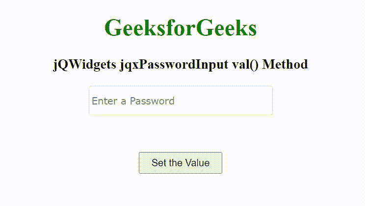

# jqwidgets jqxpassputval()方法

> 原文:[https://www . geeksforgeeks . org/jqwidgets-jqxpasswordpinput-val-method/](https://www.geeksforgeeks.org/jqwidgets-jqxpasswordinput-val-method/)

jQWidgets 是一个 JavaScript 框架，用于为 PC 和移动设备制作基于 web 的应用程序。它是一个非常强大、优化、独立于平台并且得到广泛支持的框架。jqxPasswordInput 是一个 jQuery 小部件，它支持输入字段密码，并对密码的强度有很好的视觉反馈。

**val()方法**用于设置或返回小部件的值。它不接受任何参数，也不返回值。

**语法:**

设置小部件的值。

```
$('Selector').jqxPasswordInput('val', "value");
```

返回小部件的值。

```
var password = $('Selector').jqxPasswordInput('val'); 
```

**链接文件:**从链接 https://www.jqwidgets.com/download/.下载 jQWidgets 在 HTML 文件中，找到下载文件夹中的脚本文件。

> <link rel="”stylesheet”" href="”jqwidgets/styles/jqx.base.css”" type="”text/css”">
> <脚本类型= " text/JavaScript " src = " scripts/jquery-1 . 11 . 1 . min . js "></脚本类型>
> <脚本类型= " text/JavaScript " src = " jqwidgets/jqxcore . js "></脚本类型>
> <脚本类型= " text/JavaScript " src = " jqwidgets/jqx-all . js

下面的例子说明了 jQWidgets 中的 jqxPasswordInput val()方法。

**示例:**

## 超文本标记语言

```
<!DOCTYPE html>
<html lang="en">

<head>
    <link rel="stylesheet" href=
        "jqwidgets/styles/jqx.base.css" type="text/css" />
    <link rel="stylesheet" href=
        "jqwidgets/styles/jqx.energyblue.css" type="text/css" />
    <script type="text/javascript" 
        src="scripts/jquery-1.11.1.min.js"></script>
    <script type="text/javascript" 
        src="jqwidgets/jqxcore.js"></script>
    <script type="text/javascript" 
        src="jqwidgets/jqx-all.js"></script>
    <script type="text/javascript" 
        src="jqwidgets/jqxpasswordinput.js"></script>
</head>

<body>
    <center>
        <h1 style="color: green;">
            GeeksforGeeks
        </h1>

        <h3>
            jQWidgets jqxPasswordInput val() Method
        </h3>

        <input type="password" id="input" />
        <br>
        <input type="button" id="jqxBtn" 
            value="Set the Value" 
            style="padding: 5px 15px; margin-top: 50px;">
    </center>

    <script type="text/javascript">
        $(document).ready(function() {
            $("#input").jqxPasswordInput({
                width: 250,
                height: 40,
                placeHolder: "Enter a Password"
            });

            $("#jqxBtn").on('click', function(event) {
                $('#input').jqxPasswordInput('val', "Geeks123");
            });
        });
    </script>
</body>

</html>
```

**输出:**



**参考:**[https://www . jqwidgets . com/jquery-widgets-documentation/documentation/jqxpasswordpinput/jquery-password-input-API . htm](https://www.jqwidgets.com/jquery-widgets-documentation/documentation/jqxpasswordinput/jquery-password-input-api.htm)