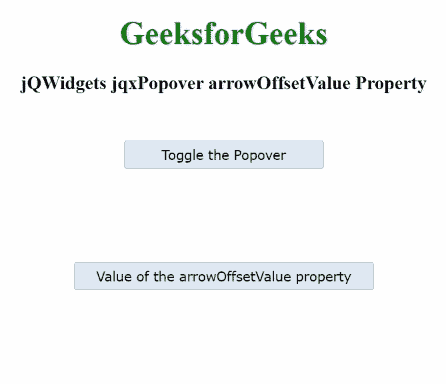

# jqwidgets jqxpexprover arrowffsetvalue property

> 原文:[https://www . geesforgeks . org/jqwidgets-jqxpopover-arrowoffsetvalue-property/](https://www.geeksforgeeks.org/jqwidgets-jqxpopover-arrowoffsetvalue-property/)

**jQWidgets** 是一个 JavaScript 框架，用于为 PC 和移动设备制作基于 web 的应用程序。它是一个非常强大、优化、独立于平台并且得到广泛支持的框架。 **jqxPopover** 是内容的小覆盖，用于在用户点击时显示任何元素的次要信息。

***箭头偏移值*** 属性用于设置或获取箭头相对于指定 **jqxPopover** 默认位置的偏移。

**语法:**

*   用于设置*箭头偏移值*属性。

    ```
    $('#jqxPopover').jqxPopover({arrowOffsetValue: 10});
    ```

*   获取*箭头偏移值*属性。

    ```
    var arrowOffsetValue = 
        $('#jqxPopover').jqxPopover('arrowOffsetValue'); 
    ```

**链接文件:**从给定链接下载 [jQWidgets](https://www.jqwidgets.com/download/) 。在 HTML 文件中，找到下载文件夹中的脚本文件。

> <link rel="”stylesheet”" href="”jqwidgets/styles/jqx.base.css”" type="”text/css”/">
> <脚本类型=“text/JavaScript”src =“scripts/jquery . js”></script>
> <脚本类型=“text/JavaScript”src =“jqwidgets/jqxcore . js”></script>
> <脚本类型=“text/JavaScript”src =“jqwidgets/jqxbuttons . js”><

**示例:**下面的示例说明了 jQWidgets jqxPopover***arrow offset value***属性。

## 超文本标记语言

```
<!DOCTYPE html>
<html lang="en">

<head>
    <link rel="stylesheet"
          href="jqwidgets/styles/jqx.base.css" 
          type="text/css"/>
    <script type="text/javascript" 
            src="scripts/jquery.js">
    </script>
    <script type="text/javascript" 
            src="jqwidgets/jqxcore.js">
    </script>
    <script type="text/javascript" 
            src="jqwidgets/jqxbuttons.js">
    </script>
    <script type="text/javascript" 
            src="jqwidgets/jqxpopover.js">
    </script>
    <script type="text/javascript" 
            src="jqwidgets/jqx-all.js">
    </script>
</head>

<body>
    <center>
        <h1 style="color:green;">
            GeeksforGeeks
        </h1>
        <h3>
            jQWidgets jqxPopover arrowOffsetValue Property
        </h3>
        <div id='jqx_Popover'>
            <center>
                GeeksforGeeks
            </center>
        </div>
        <input type="button" style="margin:28px;" 
               id="button_for_Popover" 
               value="Toggle the Popover" />
        <input type="button" style="margin: 65px;" 
               id="button_for_arrowOffsetValue"
           value="Value of the arrowOffsetValue property"/>
        <div id="log"></div>
        <script type="text/javascript">
            $(document).ready(function () {
                $("#jqx_Popover").jqxPopover({
                    width: 180,
                    height: 70,
                    arrowOffsetValue: 25,
                    theme: 'energyblue',
                    autoClose: false,
                    selector: $("#button_for_Popover"),
                    title: 'Company_Name'
                });
                $("#button_for_Popover").jqxButton({
                    width: 200,
                    theme: 'energyblue'
                });
                $("#button_for_arrowOffsetValue").jqxButton({
                    width: 300,
                    theme: 'energyblue'
                });
                $('#button_for_arrowOffsetValue')
                .jqxButton().click(function () {
                    var Value_of_arrowOffsetValue =
                        $('#jqx_Popover').jqxPopover(
                                  'arrowOffsetValue');
                        $("#log").html((
                        Value_of_arrowOffsetValue));
                })
            });
        </script>
    </center>
</body>

</html>
```

**输出:**



**参考:**[https://www . jqwidgets . com/jquery-widgets-documentation/documentation/jqxpopover/jquery-popover-API . htm？搜索=](https://www.jqwidgets.com/jquery-widgets-documentation/documentation/jqxpopover/jquery-popover-api.htm?search=)