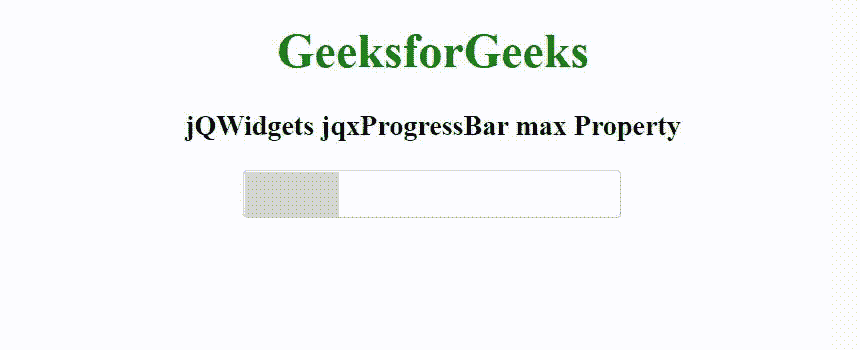

# jQWidgets jqxProgressBar 最大属性

> 原文:[https://www . geesforgeks . org/jqwidgets-jqxprogressbar-max-property/](https://www.geeksforgeeks.org/jqwidgets-jqxprogressbar-max-property/)

**jQWidgets** 是一个 JavaScript 框架，用于为 PC 和移动设备制作基于 web 的应用程序。它是一个非常强大、优化、独立于平台并且得到广泛支持的框架。jqxProgressBar 用于表示 jQuery 进度条小部件，它直观地指示冗长操作的进度。

*max* 属性用于设置或返回进度条的最大值。它接受数字类型的值，默认值为 100。

**语法:**

设置*最大*属性。

```
$('selector').jqxProgressBar({ max: Number });
```

返回*最大*属性。

```
var max = $('selector').jqxProgressBar('max');
```

**链接文件:**从链接下载 [jQWidgets](https://www.jqwidgets.com/download/.) 在 HTML 文件中，找到下载文件夹中的脚本文件。

> <link rel="”stylesheet”" href="”jqwidgets/styles/jqx.base.css”" type="”text/css”">

**示例:**以下示例说明了 jQWidgets 中的 jqxProgressBar *max* 属性。

## 超文本标记语言

```
<!DOCTYPE html>
<html lang="en">

<head>
    <link rel="stylesheet" href=
        "jqwidgets/styles/jqx.base.css" type="text/css" />
    <script type="text/javascript" 
        src="scripts/jquery-1.11.1.min.js"></script>
    <script type="text/javascript" 
        src="jqwidgets/jqx-all.js"></script>
    <script type="text/javascript" 
        src="jqwidgets/jqxcore.js"></script>
    <script type="text/javascript" 
        src="jqwidgets/jqxprogressbar.js"></script>
    <style>
        h1, h3 {
            text-align: center;            
        }
        #jqxPB {
            margin-left: 40%;
        }
    </style>
</head>

<body>
    <h1 style="color: green;">
        GeeksforGeeks
    </h1>

    <h3>
        jQWidgets jqxProgressBar max Property
    </h3>

    <div id='jqxPB'></div>

    <script type="text/javascript">
        $(document).ready(function () {
            $("#jqxPB").jqxProgressBar({
                value: 50,
                width: 250,
                height: 30,
                max: 200
            });
        });
    </script>
</body>

</html>
```

**输出:**



**参考:**[https://www . jqwidgets . com/jquery-widgets-documentation/documentation/jqxprogressbar/jquery-progressbar-API . htm](https://www.jqwidgets.com/jquery-widgets-documentation/documentation/jqxprogressbar/jquery-progressbar-api.htm)