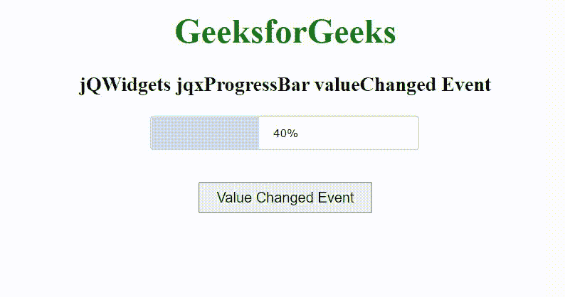

# jQWidgets jqxProgressBar 值更改事件

> 原文:[https://www . geesforgeks . org/jqwidgets-jqxprogressbar-value changed-event/](https://www.geeksforgeeks.org/jqwidgets-jqxprogressbar-valuechanged-event/)

jQWidgets 是一个 JavaScript 框架，用于为 PC 和移动设备制作基于 web 的应用程序。它是一个非常强大、优化、独立于平台并且得到广泛支持的框架。jqxProgressBar 用于表示 jQuery progressbar 小部件，它直观地指示冗长操作的进度。

**值改变事件**用于进度条值改变时触发。

**语法:**

```
$('Selector').on('valueChanged', function (event) {  });
```

**链接文件:**从链接 https://www.jqwidgets.com/download/.下载 jQWidgets 在 HTML 文件中，找到下载文件夹中的脚本文件。

> <link rel="”stylesheet”" href="”jqwidgets/styles/jqx.base.css”" type="”text/css”">
> 
> <link rel="”stylesheet”" href="”jqwidgets/styles/jqx.energyblue.css”" type="”text/css”">

下面的例子说明了 jQWidgets 中的 jqxProgressBar valueChanged 事件。

**示例:**

## 超文本标记语言

```
<!DOCTYPE html>
<html lang="en">

<head>
    <link rel="stylesheet" href=
        "jqwidgets/styles/jqx.base.css" type="text/css" />
    <link rel="stylesheet" href=
        "jqwidgets/styles/jqx.energyblue.css">
    <script type="text/javascript" 
        src="scripts/jquery-1.11.1.min.js"></script>
    <script type="text/javascript" 
        src="jqwidgets/jqx-all.js"></script>
    <script type="text/javascript" 
        src="jqwidgets/jqxcore.js"></script>
    <script type="text/javascript" 
        src="jqwidgets/jqxprogressbar.js"></script>

    <style>
        h1,
        h3 {
            text-align: center;
        }

        #jqxPB {
            margin-left: 40%;
        }
    </style>
</head>

<body>
    <h1 style="color: green;">
        GeeksforGeeks
    </h1>

    <h3>
        jQWidgets jqxProgressBar valueChanged Event
    </h3>

    <div id='jqxPB'></div>
    <center>
        <input type="button" id="jqxBtn" 
            value="Value Changed Event" 
            style="padding: 5px 15px; margin-top: 30px;">
    </center>

    <script type="text/javascript">
        $(document).ready(function() {
            $("#jqxPB").jqxProgressBar({
                theme: 'energyblue',
                width: 250,
                height: 30,
                value: 40,
                showText: true
            });

            $('#jqxBtn').on('click', function () {
                $('#jqxPB').jqxProgressBar({
                    value: 80
                });
            });

            $('#jqxPB').on('valueChanged', function (event) {
                alert('The valueChanged Event is Triggered');
            });
        });
    </script>
</body>

</html>
```

**输出:**



**参考:**[https://www . jqwidgets . com/jquery-widgets-documentation/documentation/jqxprogressbar/jquery-progressbar-API . htm](https://www.jqwidgets.com/jquery-widgets-documentation/documentation/jqxprogressbar/jquery-progressbar-api.htm)