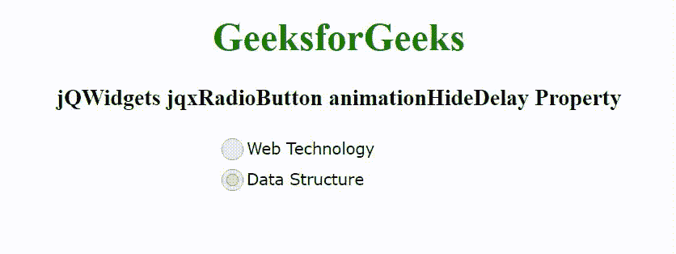

# jqwidgets jqxradiobutton animation hidedelay property

的缩写

> 原文:[https://www . geeksforgeeks . org/jqwidgets-jqxradiobutton-animation hide delay-property/](https://www.geeksforgeeks.org/jqwidgets-jqxradiobutton-animationhidedelay-property/)

jQWidgets 是一个 JavaScript 框架，用于为 PC 和移动设备制作基于 web 的应用程序。它是一个非常强大、优化、独立于平台并且得到广泛支持的框架。jqxRadioButton 小部件代表一个 jQuery 单选按钮，用于在一组互斥且相关的选项中进行选择。此小部件用于从选项组中仅选择一个选项。

当 jqxRadioButton 小部件将被取消选中时，animationH **ideDelay 属性**用于设置或返回动画的隐藏延迟。它接受数字类型的值，默认值为 300。

**语法:**

设置动画隐藏延迟属性。

```html
$('selector').jqxRadioButton({ 
    animationHideDelay: Number 
});
```

返回动画隐藏延迟属性。

```html
var AHD = $('selector')
    .jqxRadioButton('animationHideDelay');
```

**链接文件:**从给定的链接 https://www.jqwidgets.com/download/.下载 jQWidgets 在 HTML 文件中，找到下载文件夹中的脚本文件。

> <link rel="”stylesheet”" href="”jqwidgets/styles/jqx.base.css”" type="”text/css”">
> <脚本类型= " text/JavaScript " src = " scripts/jquery-1 . 11 . 1 . min . js "></脚本类型>
> <脚本类型= " text/JavaScript " src = " jqwidgets/jqxcore . js "></脚本类型>
> <脚本类型= " text/JavaScript " src = " jqwidgets/jqx-all . js

下面的例子说明了 jQWidgets jqxRadioButton animationhideday 属性。

**示例:**

## 超文本标记语言

```html
<!DOCTYPE html>
<html lang="en">

<head>
    <link rel="stylesheet" href=
    "jqwidgets/styles/jqx.base.css" type="text/css" />
    <script type="text/javascript" 
        src="scripts/jquery-1.11.1.min.js"></script>
    <script type="text/javascript" 
        src="jqwidgets/jqxcore.js"></script>
    <script type="text/javascript" 
        src="jqwidgets/jqx-all.js"></script>
    <script type="text/javascript" 
        src="jqwidgets/jqxradiobutton.js"></script>

    <style>
        h1,
        h3 {
            text-align: center;
        }

        #GFG,
        #GFG1 {
            width: 100%;
            margin: 0 auto;
        }
    </style>
</head>

<body>
    <h1 style="color: green;">
        GeeksforGeeks
    </h1>

    <h3>
        jQWidgets jqxRadioButton animationHideDelay Property
    </h3>

    <div id='GFG'>
        Web Technology
    </div>

    <div id='GFG1'>
        Data Structure
    </div>

    <script type="text/javascript">
        $(document).ready(function() {
            $("#GFG, #GFG1").jqxRadioButton({
                width: 200,
                height: 25,
                animationHideDelay: 1000
            });
        });
    </script>
</body>

</html>
```

**输出:**



**参考:**[https://www . jqwidgets . com/jquery-widgets-documentation/documentation/jqxcheckandradio/jquery-radio button-入门. htm](https://www.jqwidgets.com/jquery-widgets-documentation/documentation/jqxcheckandradio/jquery-radiobutton-getting-started.htm)