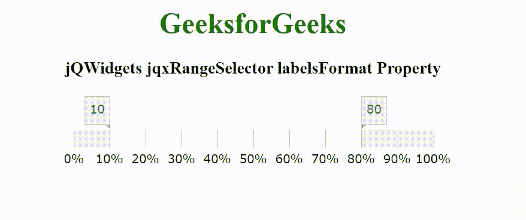

# jqwidgets jqxrplayer 标签格式属性

> 原文:[https://www . geesforgeks . org/jqwidgets-jqxrangeselector-labelsformat-property/](https://www.geeksforgeeks.org/jqwidgets-jqxrangeselector-labelsformat-property/)

jQWidgets 是一个 JavaScript 框架，用于为 PC 和移动设备制作基于 web 的应用程序。它是一个非常强大、优化、独立于平台并且得到广泛支持的框架。jqxRangeSelector 小部件用于表示 jQuery 范围滑块，该滑块可轻松用于选择数值或日期范围值。这个小部件用于设置数字、天、周、月、年等范围。

labelsFormat 属性用于设置或返回标签的格式。它接受字符串类型值，默认值为空。

其可能的数字格式是–

*   **‘d’–**表示十进制数。
*   **'f'-** 表示浮点数。
*   **‘n’–**表示整数。
*   **‘c’–**表示货币数字。
*   **‘p’–**表示百分比数字。

它可能的日期格式是–

*   **‘d’–**代表一个月中的某一天。
*   **‘DD’–**表示一个月中的某一天。
*   **‘DDD’–**是星期几的缩写。
*   **‘dddd’–**是一周中某一天的全称。
*   **‘h’–**用 1 到 12 的 12 小时制表示小时。
*   **‘hh’–**表示从 01 到 12 使用 12 小时制的小时。
*   **‘H’–**它代表使用从 0 到 23 的 24 小时时钟的小时。
*   **‘HH’–**表示从 00 到 23 使用 24 小时制的小时。
*   **‘m’–**表示分钟，从 0 到 59。
*   **‘mm’–**表示分钟，从 00 到 59。
*   **‘M’–**表示月份，从 1 到 12。
*   **‘MM’–**表示月份，从 01 到 12。
*   **‘MMM’–**表示月份的缩写名称。
*   **‘MMMM’–**代表月份的全称。
*   **' s–**表示秒，从 0 到 59。
*   **‘ss’–**表示第二个，从 00 到 59。
*   **‘t’–**代表 AM/PM 指示符的第一个字符。
*   **“TT”–**代表上午/下午指示符。
*   **‘y’–**代表年份，从 0 到 99。
*   **‘YY’–**代表年份，从 00 到 99。
*   **‘yyy’–**表示年份，最少三位数。
*   **‘yyyy’–**用四位数表示年份。

**语法:**

设置标签格式属性。

```
$('selector').jqxRangeSelector({ labelsFormat: String });
```

返回标签格式属性。

```
var labelsFormat = 
    $('selector').jqxRangeSelector('labelsFormat');
```

**链接文件:**从给定的链接 https://www.jqwidgets.com/download/.下载 jQWidgets 在 HTML 文件中，找到下载文件夹中的脚本文件。

> <link rel="”stylesheet”" href="”jqwidgets/styles/jqx.base.css”" type="”text/css”">
> <脚本类型=【text/JavaScript】src =【scripts/jquery-1 . 11 . 1 . min . js】></脚本>
> <脚本类型=【text/JavaScript】src =【jqwidgets/jqxcore . js】></脚本>
> 脚本类型=【text/JavaScript】src =【jqwidgets/jqx-all。

下面的例子说明了 jQWidgets jqxRangeSelector labelsFormat 属性。

**示例:**

## 超文本标记语言

```
<!DOCTYPE html>
<html lang="en">

<head>
    <link rel="stylesheet" href=
    "jqwidgets/styles/jqx.base.css" type="text/css" />
    <script type="text/javascript" 
        src="scripts/jquery-1.11.1.min.js"></script>
    <script type="text/javascript" 
        src="jqwidgets/jqxcore.js"></script>
    <script type="text/javascript" 
        src="jqwidgets/jqx-all.js"></script>
    <script type="text/javascript" 
        src="jqwidgets/jqxdata.js"></script>
    <script type="text/javascript" 
        src="jqwidgets/jqxrangeselector.js"></script>

    <style>
        h1,
        h3 {
            text-align: center;
        }

        #jqxRS {
            width: 100%;
            margin: 0 auto;
        }
    </style>
</head>

<body>
    <h1 style="color: green;">
        GeeksforGeeks
    </h1>

    <h3>
        jQWidgets jqxRangeSelector labelsFormat Property
    </h3>

    <div id="jqxRS"></div>

    <script type="text/javascript">
        $(document).ready(function() {
            $("#jqxRS").jqxRangeSelector({
                width: 400,
                height: 20,
                min: 0,
                max: 100,
                range: {
                    from: 10,
                    to: 80
                },
                labelsFormat: 'p'
            });
        });
    </script>
</body>

</html>
```

**输出:**



**参考:**[https://www . jqwidgets . com/jquery-widgets-documentation/documentation/jqxrange selector/jquery-range selector-API . htm](https://www.jqwidgets.com/jquery-widgets-documentation/documentation/jqxrangeselector/jquery-rangeselector-api.htm)