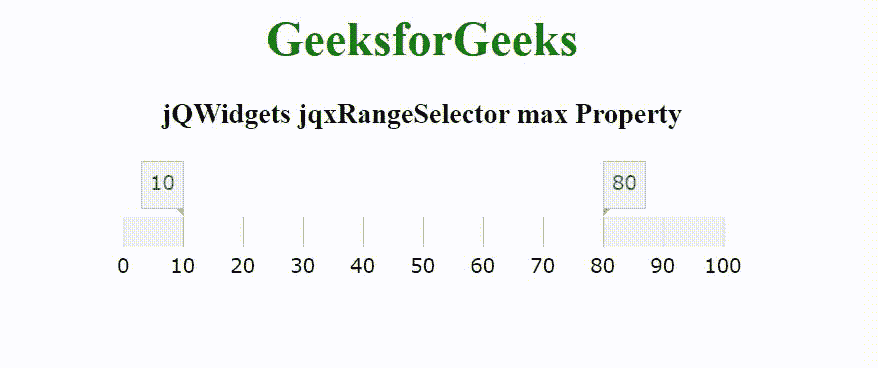

# jqwidgets jqxroter max property

> 原文:[https://www . geesforgeks . org/jqwidgets-jqxrangeselector-max-property/](https://www.geeksforgeeks.org/jqwidgets-jqxrangeselector-max-property/)

jQWidgets 是一个 JavaScript 框架，用于为 PC 和移动设备制作基于 web 的应用程序。它是一个非常强大、优化、独立于平台并且得到广泛支持的框架。jqxRangeSelector 小部件用于表示 jQuery 范围滑块，该滑块可轻松用于选择数值或日期范围值。这个小部件用于设置数字、天、周、月、年等范围。

**最大属性**用于设置或返回范围选择器刻度的最大值。它接受数字/日期对象/日期字符串类型值，默认值为 100。

**语法:**

设置 max 属性。

```
$('selector').jqxRangeSelector({ 
    max: Number/Date object/Date string 
});
```

返回 max 属性。

```
var max = $('selector').jqxRangeSelector('max');
```

**链接文件:**从给定的链接 https://www.jqwidgets.com/download/.下载 jQWidgets 在 HTML 文件中，找到下载文件夹中的脚本文件。

> <link rel="”stylesheet”" href="”jqwidgets/styles/jqx.base.css”" type="”text/css”">
> <脚本类型=【text/JavaScript】src =【scripts/jquery-1 . 11 . 1 . min . js】></脚本>
> <脚本类型=【text/JavaScript】src =【jqwidgets/jqxcore . js】></脚本>
> 脚本类型=【text/JavaScript】src =【jqwidgets/jqx-all。

下面的例子说明了 jQWidgets jqxRangeSelector max 属性。

**示例:**

## 超文本标记语言

```
<!DOCTYPE html>
<html lang="en">

<head>
    <link rel="stylesheet" href=
        "jqwidgets/styles/jqx.base.css" type="text/css" />
    <script type="text/javascript" 
        src="scripts/jquery-1.11.1.min.js"></script>
    <script type="text/javascript" 
        src="jqwidgets/jqxcore.js"></script>
    <script type="text/javascript" 
        src="jqwidgets/jqx-all.js"></script>
    <script type="text/javascript" 
        src="jqwidgets/jqxdata.js"></script>
    <script type="text/javascript" 
        src="jqwidgets/jqxrangeselector.js"></script>

    <style>
        h1,
        h3 {
            text-align: center;
        }

        #jqxRS {
            width: 100%;
            margin: 0 auto;
        }
    </style>
</head>

<body>
    <h1 style="color: green;">
        GeeksforGeeks
    </h1>

    <h3>
        jQWidgets jqxRangeSelector max Property
    </h3>

    <div id="jqxRS"></div>

    <script type="text/javascript">
        $(document).ready(function() {
            $("#jqxRS").jqxRangeSelector({
                width: 400,
                height: 20,
                min: 0,
                max: 100,
                range: {
                    from: 10,
                    to: 80
                }
            });
        });
    </script>
</body>

</html>
```

**输出:**



**参考:**[https://www . jqwidgets . com/jquery-widgets-documentation/documentation/jqxrange selector/jquery-range selector-API . htm](https://www.jqwidgets.com/jquery-widgets-documentation/documentation/jqxrangeselector/jquery-rangeselector-api.htm)