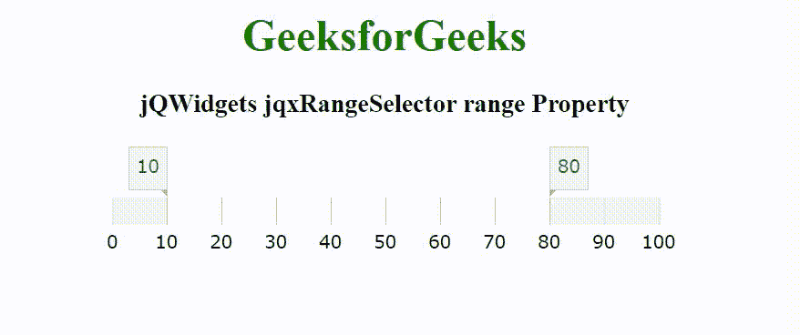

# jQWidgets jqxRangeSelector 范围属性

> 原文:[https://www . geesforgeks . org/jqwidgets-jqxrangeselector-range-property/](https://www.geeksforgeeks.org/jqwidgets-jqxrangeselector-range-property/)

jQWidgets 是一个 JavaScript 框架，用于为 PC 和移动设备制作基于 web 的应用程序。它是一个非常强大、优化、独立于平台并且得到广泛支持的框架。jqxRangeSelector 小部件用于表示 jQuery 范围滑块，该滑块可轻松用于选择数值或日期范围值。这个小部件用于设置数字、天、周、月、年等范围。

**范围属性**用于设置或返回包含以下属性的对象–

*   **从–**指定起始范围。它的可能值是–数字、日期对象和日期字符串。
*   **至–**指定结束范围。它的可能值是–数字、日期对象和日期字符串。
*   **min–**指定选择的最小值。它的可能值是–number、具有以下属性之一的对象:{毫秒、秒、分钟、小时、天、周}或以下字符串之一:“毫秒”、“秒”、“分钟”、“小时”、“天”、“周”。
*   **最大值–**指定选择的最大值。它的可能值是–number、具有以下属性之一的对象:{毫秒、秒、分钟、小时、天、周}或以下字符串之一:“毫秒”、“秒”、“分钟”、“小时”、“天”、“周”。

它接受对象类型值，默认值为{从:0 到:无穷大，最小值:0，最大值:无穷大}。

**语法:**

设置 range 属性。

```
$('selector').jqxRangeSelector({ range: {
    from: Number/Date
    to: Number/Date
    min: Number/Date
    max: Number/Date
} });
```

返回 range 属性。

```
var range = $('selector').jqxRangeSelector('range');
```

**链接文件:**从给定的链接 https://www.jqwidgets.com/download/.下载 jQWidgets 在 HTML 文件中，找到下载文件夹中的脚本文件。

> <link rel="”stylesheet”" href="”jqwidgets/styles/jqx.base.css”" type="”text/css”">
> <脚本类型= " text/JavaScript " src = " scripts/jquery-1 . 11 . 1 . min . js "></脚本类型>
> <脚本类型= " text/JavaScript " src = " jqwidgets/jqxcore . js "></脚本类型>
> <脚本类型= " text/JavaScript " src = " jqwidgets/jqx-all . js

下面的例子说明了 jQWidgets jqxRangeSelector 范围属性。

**示例:**

## 超文本标记语言

```
<!DOCTYPE html>
<html lang="en">

<head>
    <link rel="stylesheet" href=
        "jqwidgets/styles/jqx.base.css" type="text/css" />
    <script type="text/javascript" 
        src="scripts/jquery-1.11.1.min.js"></script>
    <script type="text/javascript" 
        src="jqwidgets/jqxcore.js"></script>
    <script type="text/javascript" 
        src="jqwidgets/jqx-all.js"></script>
    <script type="text/javascript" 
        src="jqwidgets/jqxdata.js"></script>
    <script type="text/javascript" 
        src="jqwidgets/jqxrangeselector.js"></script>

    <style>
        h1,
        h3 {
            text-align: center;
        }

        #jqxRS {
            width: 100%;
            margin: 0 auto;
        }
    </style>
</head>

<body>
    <h1 style="color: green;">
        GeeksforGeeks
    </h1>

    <h3>
        jQWidgets jqxRangeSelector range Property
    </h3>

    <div id="jqxRS"></div>

    <script type="text/javascript">
        $(document).ready(function() {
            $("#jqxRS").jqxRangeSelector({
                width: 400,
                height: 20,
                min: 0,
                max: 100,
                range: {
                    from: 10,
                    to: 80
                }
            });
        });
    </script>
</body>

</html>
```

**输出:**



**参考:**[https://www . jqwidgets . com/jquery-widgets-documentation/documentation/jqxrange selector/jquery-range selector-API . htm](https://www.jqwidgets.com/jquery-widgets-documentation/documentation/jqxrangeselector/jquery-rangeselector-api.htm)