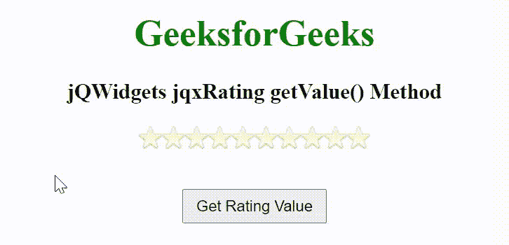

# jQWidgets jqxRating getValue()方法

> 原文:[https://www . geesforgeks . org/jqwidgets-jqxrating-getvalue-method/](https://www.geeksforgeeks.org/jqwidgets-jqxrating-getvalue-method/)

**jQWidgets** 是一个 JavaScript 框架，用于为 PC 和移动设备制作基于 web 的应用程序。它是一个非常强大、优化、独立于平台并且得到广泛支持的框架。jqxRating 表示一个 jQuery 小部件，显示评级选项以选择评级。此小部件用于配置 jqxRating 小部件项目的大小、图像和显示项目的数量等。

**getValue()** 方法用于获取 jqxRating 小部件的当前评级值。它不接受任何参数，也不返回值。

**语法:**

```
$('Selector').jqxRating('getValue');
```

**链接文件:**从给定链接下载 [jQWidgets](https://www.jqwidgets.com/download/) 。在 HTML 文件中，找到下载文件夹中的脚本文件。

> <link rel="”stylesheet”" href="”jqwidgets/styles/jqx.base.css”" type="”text/css”">
> < link rel= "样式表" href = " jqwidgets/style/jqx . energy blue . CSS " type = " text/CSS "/>
> <脚本类型= " text/JavaScript " src = " scripts/jquery-1 . 11 . 1 . min . js "></脚本>
> <脚本类型= " text/JavaScript " src = " jqwidgets/jqx-all

**示例:**下面的示例说明了 jQWidgets jqxRating**getValue()**方法。

## 超文本标记语言

```
<!DOCTYPE html>
<html lang="en">

<head>
    <link rel="stylesheet" href=
        "jqwidgets/styles/jqx.base.css" type="text/css" />
    <link rel="stylesheet" href=
        "jqwidgets/styles/jqx.energyblue.css" type="text/css" />
    <script type="text/javascript" 
        src="scripts/jquery-1.11.1.min.js"></script>
    <script type="text/javascript" 
        src="jqwidgets/jqx-all.js"></script>
    <script type="text/javascript" 
        src="jqwidgets/jqxcore.js"></script>
    <script type="text/javascript" 
        src="jqwidgets/jqxrating.js"></script>
</head>

<body>
    <center>
        <h1 style="color: green;">
            GeeksforGeeks
        </h1>

        <h3>
            jQWidgets jqxRating getValue() Method
        </h3>

        <div id='jqxRating'></div>

        <input type="button" value="Get Rating Value" id="GFG"
            style="padding: 5px 10px; margin-top: 20px;">
    </center>

    <script type="text/javascript">
        $(document).ready(function() {
            $("#jqxRating").jqxRating({
                width: 200,
                height: 35,
                count: 10
            });

            $("#GFG").on('click', function() {
                var val = $('#jqxRating').jqxRating('getValue'); 

                alert("Rating value: " + val);
            });
        });
    </script>
</body>

</html>
```

**输出:**



**参考:**[https://www . jqwidgets . com/jquery-widgets-documentation/documentation/jqxrating/jquery-rating-API . htm](https://www.jqwidgets.com/jquery-widgets-documentation/documentation/jqxrating/jquery-rating-api.htm)