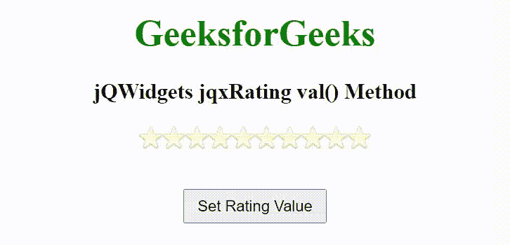

# jQWidgets jqxRating val()方法

> 原文:[https://www . geesforgeks . org/jqwidgets-jqxrating-val-method/](https://www.geeksforgeeks.org/jqwidgets-jqxrating-val-method/)

**jQWidgets** 是一个 JavaScript 框架，用于为 PC 和移动设备制作基于 web 的应用程序。它是一个非常强大、优化、独立于平台并且得到广泛支持的框架。jqxRating 表示一个 jQuery 小部件，它显示评级选项来选择评级。此小部件用于配置 jqxRating 小部件项目的大小、图像和显示项目的数量等。

**val()** 方法用于设置或返回 jqxRating 小部件的值。它接受数字类型的单个参数值，并返回数字类型的值。

**语法:**

设置值:

```
$("Selector").jqxRating('val', Number);
$("Selector").val(Number);
```

返回值:

```
var value = $("Selector").jqxRating('val');
var value = $("Selector").val();
```

**链接文件:**从链接下载 [jQWidgets](https://www.jqwidgets.com/download/) 。在 HTML 文件中，找到下载文件夹中的脚本文件。

> <link rel="”stylesheet”" href="”jqwidgets/styles/jqx.base.css”" type="”text/css”">
> < link rel= "样式表" href = " jqwidgets/style/jqx . energy blue . CSS " type = " text/CSS "/>
> <脚本类型= " text/JavaScript " src = " scripts/jquery-1 . 11 . 1 . min . js "></脚本>
> <脚本类型= " text/JavaScript " src = " jqwidgets/jqx-all

下面的例子说明了 jQWidgets jqxRating val()方法。

**示例:**

## 超文本标记语言

```
<html>
  <head>
    <link rel="stylesheet" 
          href="jqwidgets/styles/jqx.base.css" 
          type="text/css" />
    <script type="text/javascript"
            src="scripts/jquery-1.11.1.min.js">
    </script>
    <script type="text/javascript" 
            src="jqwidgets/jqx-all.js">
    </script>
    <script type="text/javascript" 
            src="jqwidgets/jqxcore.js">
    </script>
    <script type="text/javascript" 
            src="jqwidgets/jqxbuttons.js">
    </script>
    <script type="text/javascript" 
            src="jqwidgets/jqxscrollbar.js">
    </script>
    <script type="text/javascript" 
            src="jqwidgets/jqxlistbox.js">
    </script>
  </head>
  <body>
    <center>
      <h1 style="color: green;">
        GeeksforGeeks
      </h1>

      <h3>
        jQWidgets jqxRating val() Method
      </h3>

      <div id='jqxRating'></div>

      <input type="button" 
             value="Set Rating Value" id="GFG"
             style="padding: 5px 10px; margin-top: 20px;">
    </center>
    <script type="text/javascript">
      $(document).ready(function() {
        $("#jqxRating").jqxRating({
          width: 200,
          height: 35,
          count: 10
        });

        $("#GFG").on('click', function() {
          $('#jqxRating').jqxRating('val', 6); 
        });
      });
    </script>
  </body>
</html>
```

**输出:**



**参考:**[https://www . jqwidgets . com/jquery-widgets-documentation/documentation/jqxrating/jquery-rating-API . htm](https://www.jqwidgets.com/jquery-widgets-documentation/documentation/jqxrating/jquery-rating-api.htm)