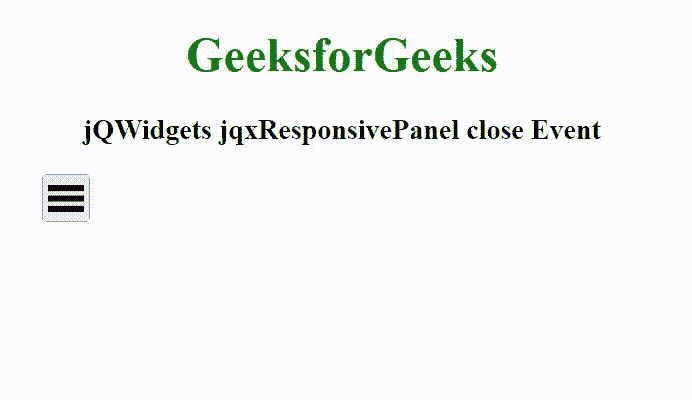

# jQWidgets jqxResponsivePanel 关闭事件

> 原文:[https://www . geesforgeks . org/jqwidgets-jqxresponsevepanel-close-event/](https://www.geeksforgeeks.org/jqwidgets-jqxresponsivepanel-close-event/)

jQWidgets 是一个 JavaScript 框架，用于为 PC 和移动设备制作基于 web 的应用程序。它是一个非常强大、优化、独立于平台并且得到广泛支持的框架。jqxResponsivePanel 是一个 jQuery 小部件，用于表示具有响应行为的面板小部件。响应面板用于以响应方式显示内容。当浏览器窗口的宽度小于设定值时，此面板折叠，单击按钮后，我们可以访问该值。

**关闭事件**用于在响应面板完成关闭时触发。

**语法:**

```
$('Selector').on('close', function () {  });
```

**链接文件:**从链接 https://www.jqwidgets.com/download/.下载 jQWidgets 在 HTML 文件中，找到下载文件夹中的脚本文件。

> <link rel="”stylesheet”" href="”jqwidgets/styles/jqx.base.css”" type="”text/css”">
> <脚本类型= " text/JavaScript " src = " scripts/jquery-1 . 11 . 1 . min . js "></脚本类型>
> <脚本类型= " text/JavaScript " src = " jqwidgets/jqxcore . js "></脚本类型>
> <脚本类型= " text/JavaScript " src = " jqwidgets/jqx-all . js

以下示例说明了 jQWidgets 中的 jqxResponsivePanel 关闭事件

**示例:**

## 超文本标记语言

```
<!DOCTYPE html>
<html lang="en">

<head>
    <link rel="stylesheet" 
          href="jqwidgets/styles/jqx.base.css" 
          type="text/css" />
    <link rel="stylesheet" 
          href="jqwidgets/styles/jqx.energyblue.css" 
          type="text/css" />
    <script type="text/javascript" 
            src="scripts/jquery-1.11.1.min.js">
    </script>
    <script type="text/javascript" 
        src="jqwidgets/jqxcore.js">
    </script>
    <script type="text/javascript" 
        src="jqwidgets/jqx-all.js">
    </script>
    <script type="text/javascript" 
        src="jqwidgets/jqxresponsivepanel.js">
    </script>

    <style>
        h1,
        h3 {
            text-align: center;
        }

        #GFG {
            width: 100%;
            margin: 0 auto;
        }
    </style>
</head>

<body>
    <h1 style="color: green;">
        GeeksforGeeks
    </h1>

    <h3>
        jQWidgets jqxResponsivePanel close Event
    </h3>

    <div id="GFG" style="width: 400px;">
        <div id="TRP"></div>

        <div id="jqxRP" style="padding: 5px;">
            <h4>HTML</h4>
            <p>
                HTML stands for HyperText Markup 
                Language. It is used to design 
                web pages using a markup language. 
                HTML is the combination of Hypertext 
                and Markup language. Hypertext 
                defines the link between the web pages.
            </p>

        </div>
    </div>

    <script type="text/javascript">
        $(document).ready(function() {
            $('#jqxRP').jqxResponsivePanel({
                width: 400,
                height: 250,
                toggleButton: $('#TRP')
            });

            $('#jqxRP').on('close', function () {
                alert("Widget Collapsed!")
            });
        });
    </script>
</body>

</html>
```

**输出:**



**参考:**[https://www . jqwidgets . com/jquery-widgets-documentation/documentation/jqxresponsivepanel/jquery-responsive-panel-API . htm](https://www.jqwidgets.com/jquery-widgets-documentation/documentation/jqxresponsivepanel/jquery-responsive-panel-api.htm)