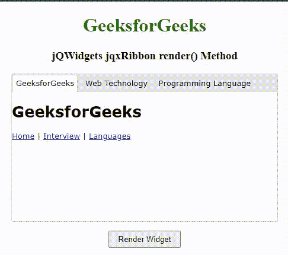

# jQWidgets jqxRibbon 渲染()方法

> 原文:[https://www . geesforgeks . org/jqwidgets-jqxribbon-render-method/](https://www.geeksforgeeks.org/jqwidgets-jqxribbon-render-method/)

**jQWidgets** 是一个 JavaScript 框架，用于为 PC 和移动设备制作基于 web 的应用程序。它是一个非常强大和优化的框架，独立于平台，并得到广泛支持。 **jqxRibbon** 是一个 jQuery 小部件，可以用作选项卡式工具栏或大型菜单。

**render()** 方法用于在屏幕上渲染 jqxRibbon 小部件。它不接受任何参数，也不返回值。

**语法:**

```
$('#jqxRibbon').jqxRibbon('render');
```

**链接文件:**从给定链接下载 [jQWidgets](https://www.jqwidgets.com/download/) 。在 HTML 文件中，找到下载文件夹中的脚本文件。

> <link rel="”stylesheet”" href="”jqwidgets/styles/jqx.base.css”" type="”text/css”">
> <脚本类型= " text/JavaScript " src = " scripts/jquery-1 . 11 . 1 . min . js "></脚本类型>
> <脚本类型= " text/JavaScript " src = " jqwidgets/jqxcore . js "></脚本类型>
> <脚本类型= " text/JavaScript " src = " jqwidgets/jqx-all . js

**示例:**下面的示例说明了 jQWidgets jqxRibbon**render()**方法。

## 超文本标记语言

```
<!DOCTYPE html>
<html lang="en">
  <head>
    <link
      rel="stylesheet"
      href="jqwidgets/styles/jqx.base.css"
      type="text/css" />
    <link
      rel="stylesheet"
      href="jqwidgets/styles/jqx.energyblue.css"
      type="text/css" />
    <script type="text/javascript" 
            src="scripts/jquery-1.11.1.min.js">
    </script>
    <script type="text/javascript" 
            src="jqwidgets/jqx-all.js">
    </script>
    <script type="text/javascript" 
            src="jqwidgets/jqxcore.js">
    </script>
    <script type="text/javascript" 
            src="jqwidgets/jqxribbon.js">
    </script>
  </head>

  <body>
    <center>
      <h1 style="color: green">GeeksforGeeks</h1>
      <h3>jQWidgets jqxRibbon render() Method</h3>
    </center>

    <div id="jqxRibbon" style="margin: auto">
      <ul>
        <li>GeeksforGeeks</li>
        <li>Web Technology</li>
        <li>Programming Language</li>
      </ul>
    <div>
        <div>
          <h1>GeeksforGeeks</h1>

          <nav>
            <a href="#">Home</a> | 
            <a href="#">Interview</a> |
            <a href="#">Languages</a>
          </nav>
        </div>

        <div>
          <h1>Web Technology</h1>

          <nav>
            <a href="#">HTML</a> | 
            <a href="#">CSS</a> |
            <a href="#">JavaScript</a>
          </nav>
        </div>

        <div>
          <h1>Programming Language</h1>

          <nav>
            <a href="#">C Programming</a> | 
            <a href="#">C++ Programming</a> |
            <a href="#">Java Programming</a>
          </nav>
        </div>
      </div>
    </div>

    <center>
      <input
        type="button"
        id="jqxBtn"
        value="Render Widget"
        style="padding: 5px 15px; 
               margin-top: 15px"/>
    </center>

    <script type="text/javascript">
      $(document).ready(function () {
        $("#jqxRibbon").jqxRibbon({
          width: 450,
          height: 250,
          reorder: true,
        });

        $("#jqxBtn").on("click", function () {
          $("#jqxRibbon").jqxRibbon("render");
          alert("Widget Rendering");
        });
      });
    </script>
  </body>
</html>
```

**输出:**



**参考:**[https://www . jqwidgets . com/jquery-widgets-documentation/documentation/jqxribbon/jquery-ribbon-API . htm](https://www.jqwidgets.com/jquery-widgets-documentation/documentation/jqxribbon/jquery-ribbon-api.htm)