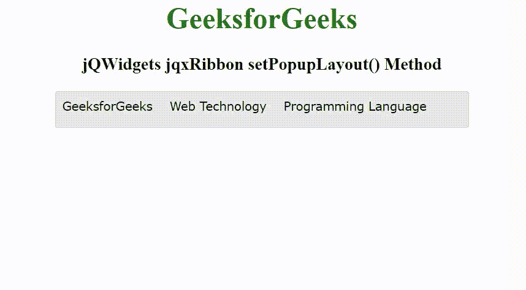

# jqwidgets jqxribon setpopupout()方法

> 原文:[https://www . geesforgeks . org/jqwidgets-jqxribbon-set opuplayout-method/](https://www.geeksforgeeks.org/jqwidgets-jqxribbon-setpopuplayout-method/)

**jQWidgets** 是一个 JavaScript 框架，用于为 PC 和移动设备制作基于 web 的应用程序。它是一个非常强大和优化的框架，独立于平台，并得到广泛支持。 **jqxRibbon** 是一个 jQuery 小部件，可以用作选项卡式工具栏或大型菜单。

如果模式设置为“弹出”，则使用**setopuplayout()**方法来设置项目内容的布局。

**语法:**

```html
$('#jqxRibbon').jqxRibbon('setPopupLayout', 
        index, layout, width, height);
```

**参数:**该方法接受下列四个参数:

*   **指标:**表示指标编号。
*   **布局:**描述内容的布局。它接受字符串类型的值，其可能的值是–“默认”、“近”、“远”、“中”。
*   **宽度:**描述元素的宽度。
*   **高度:**描述元素的高度。

**链接文件:**从给定的链接下载 jQWidgets。在 HTML 文件中，找到下载文件夹中的脚本文件。

> <link rel="”stylesheet”" href="”jqwidgets/styles/jqx.base.css”" type="”text/css”">
> <脚本类型= " text/JavaScript " src = " scripts/jquery-1 . 11 . 1 . min . js "></脚本类型>
> <脚本类型= " text/JavaScript " src = " jqwidgets/jqxcore . js "></脚本类型>
> <脚本类型= " text/JavaScript " src = " jqwidgets/jqx-all . js

下面的例子说明了 jQWidgets jqxRibbon**setopuplayout()**方法。

**示例:**

## 超文本标记语言

```html
<!DOCTYPE html>
<html lang="en">

<head>
    <link rel="stylesheet" 
          href="jqwidgets/styles/jqx.base.css"
          type="text/css" />
    <link rel="stylesheet"
          href="jqwidgets/styles/jqx.energyblue.css"
          type="text/css" />
    <script type="text/javascript" 
            src="scripts/jquery-1.11.1.min.js">
    </script>
    <script type="text/javascript" 
            src="jqwidgets/jqx-all.js">
    </script>
    <script type="text/javascript" 
            src="jqwidgets/jqxcore.js">
    </script>
    <script type="text/javascript" 
            src="jqwidgets/jqxribbon.js">
    </script>
</head>

<body>
    <center>
        <h1 style="color: green;">
            GeeksforGeeks
        </h1>

        <h3>
            jQWidgets jqxRibbon setPopupLayout() Method
        </h3>
    </center>

    <div id="jqxRibbon" style="margin: auto;">
        <ul>
            <li>GeeksforGeeks</li>
            <li>Web Technology</li>
            <li>Programming Language</li>
        </ul>
        <div>
            <div>
                <h1>GeeksforGeeks</h1>

                <nav>
                    <a href="#">Home</a> |
                    <a href="#">Interview</a> |
                    <a href="#">Languages</a>
                </nav>
            </div>

            <div>
                <h1>Web Technology</h1>

                <nav>
                    <a href="#">HTML</a> |
                    <a href="#">CSS</a> |
                    <a href="#">JavaScript</a>
                </nav>
            </div>

            <div>
                <h1>Programming Language</h1>

                <nav>
                    <a href="#">C Programming</a> |
                    <a href="#">C++ Programming</a> |
                    <a href="#">Java Programming</a>
                </nav>
            </div>
        </div>
    </div>

    <script type="text/javascript">
        $(document).ready(function() {
            $("#jqxRibbon").jqxRibbon({
                width: 450,
                height: 40,
                reorder: true,
                mode: "popup",
                position: "top",
                selectionMode: "click",
                animationType: "slide"
            });

            $('#jqxRibbon').jqxRibbon(
                'setPopupLayout', 0, "near", 200, 150);
            $('#jqxRibbon').jqxRibbon(
                'setPopupLayout', 1, "center", 200, 150);
            $('#jqxRibbon').jqxRibbon(
                'setPopupLayout', 2, "far", 200, 150);
        });
    </script>
</body>

</html>
```

**输出:**



**参考:**[https://www . jqwidgets . com/jquery-widgets-documentation/documentation/jqxribbon/jquery-ribbon-API . htm](https://www.jqwidgets.com/jquery-widgets-documentation/documentation/jqxribbon/jquery-ribbon-api.htm)