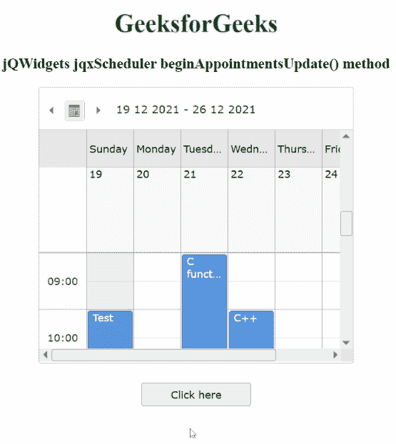

# jQWidgets jqxScheduler beginapointupdate()方法

> 原文:[https://www . geesforgeks . org/jqwidgets-jqxscheduler-beginapoptmentupdate-method/](https://www.geeksforgeeks.org/jqwidgets-jqxscheduler-beginappointmentsupdate-method/)

**jQWidgets** 是一个 JavaScript 框架，用于为 PC 和移动设备制作基于 web 的应用程序。它是一个非常强大、优化、独立于平台并且得到广泛支持的框架。 **jqxScheduler** 小部件用于显示日、周、月、时间轴日、时间轴周以及时间轴月视图中的一组约会。

**开始预约更新()** **方法**用于开始更新过程以及结束日程安排和预约渲染。它没有参数，也不返回任何内容。

**语法:**

```
$('#Selector').jqxScheduler('beginAppointmentsUpdate');
```

**链接文件:**从给定链接下载 [jQWidgets](https://www.jqwidgets.com/download/) 。在 HTML 文件中，找到下载文件夹中的脚本文件。

> <link rel="”stylesheet”" href="”jqwidgets/styles/jqx.base.css”" type="”text/css”">
> <脚本类型= " text/JavaScript " src = " scripts/jquery-1 . 11 . 1 . min . js "></脚本>
> <脚本类型= " text/JavaScript " src = " jqwidgets/jqx-all . js "></脚本>
> 脚本类型= " text/JavaScript " src = " jqwidgets/jqxscheduler

下面的例子说明了 jqxScheduler **在 jQWidgets 中的 beginAppointmentsUpdate()方法**。

**示例:**

## 超文本标记语言

```
<!DOCTYPE html>
<html lang="en">

<head>
    <link rel="stylesheet" 
          href="jqwidgets/styles/jqx.base.css"
          type="text/css" />
    <script type="text/javascript" 
            src="scripts/jquery-1.11.1.min.js">
      </script>
    <script type="text/javascript" 
            src="jqwidgets/jqx-all.js">
      </script>
    <script type="text/javascript" 
            src="jqwidgets/jqxscheduler.js">
      </script>
    <script type="text/javascript"
            src="jqwidgets/jqxscheduler.api.js">
      </script>
</head>

<body>
    <center>
        <h1 style="color:green">
            GeeksforGeeks
        </h1>

        <h3>jQWidgets jqxScheduler
            beginAppointmentsUpdate() method
        </h3>

        <div id="jqxs"></div>

        <div>
            <input type="button" id="jqxBtn" 
                   style="margin-top: 25px" 
                   value="Click here" />
        </div>
        <br>

        <div id="log"></div>
    </center>

    <script type="text/javascript">
        $(document).ready(function () {
            var onlineClasses = new Array();
            var day1 = {
                id: "1",
                Topic: "C functions",
                begin: new Date(2021, 11, 21, 9),
                end: new Date(2021, 11, 21, 16)
            }
            var day2 = {
                id: "2",
                Topic: "C++",
                begin: new Date(2021, 11, 22, 10),
                end: new Date(2021, 11, 22, 15)
            }
            var day3 = {
                id: "3",
                Topic: "Java",
                begin: new Date(2021, 11, 23, 11),
                end: new Date(2021, 11, 23, 13)
            }
            var day4 = {
                id: "4",
                Topic: "Scala library functions",
                begin: new Date(2021, 11, 25, 16),
                end: new Date(2021, 11, 25, 18)
            }
            var day5 = {
                id: "5",
                Topic: "Test",
                begin: new Date(2021, 11, 19, 10),
                end: new Date(2021, 11, 19, 11)
            }
            onlineClasses.push(day1, day2, day3, day4, day5);
            var source =
            {
                dataType: "array",
                localData: onlineClasses,
                id: 'id'
            };
            var adapter = new $.jqx.dataAdapter(source);
            $("#jqxs").jqxScheduler({
                date: new $.jqx.date(2021, 12, 19),
                source: adapter,
                width: "400px",
                height: "350px",
                view: 'weekView',
                views: ['weekView'],
                appointmentDataFields:
                {
                    id: "id",
                    subject: "Topic",
                    from: "begin",
                    to: "end",
                },

            });
            $("#jqxBtn").jqxButton({
                width: "140px",
                height: "30px",
            });
            $('#jqxs').jqxScheduler(
              'ensureAppointmentVisible', '1'
            );
            $("#jqxBtn").on("click", function () {
                $('#jqxs').jqxScheduler(
                  'beginAppointmentsUpdate'
                );
                $('#log').text(
                  "Appointment update began!"
                );
            });
        });
    </script>
</body>

</html>
```

**输出:**



**参考:**[https://www . jqwidgets . com/jquery-widgets-documentation/documentation/jqxscheduler/jquery-scheduler-API . htm](https://www.jqwidgets.com/jquery-widgets-documentation/documentation/jqxscheduler/jquery-scheduler-api.htm)