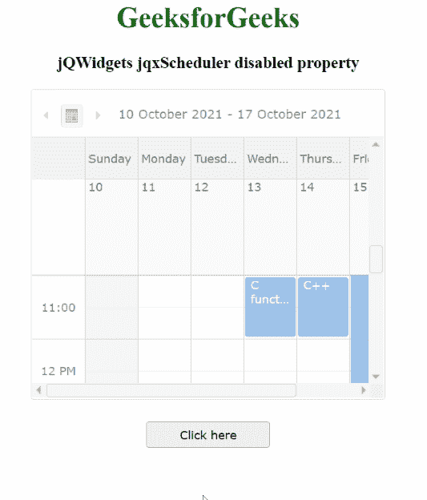

# jQWidgets jqxScheduler 禁用属性

> 原文:[https://www . geesforgeks . org/jqwidgets-jqxscheduler-disabled-property/](https://www.geeksforgeeks.org/jqwidgets-jqxscheduler-disabled-property/)

jQWidgets 是一个 JavaScript 框架，用于为 PC 和移动设备制作基于 web 的应用程序。它是一个非常强大、优化、独立于平台并且得到广泛支持的框架。jqxScheduler 小部件用于在日、周、月、时间轴日、时间轴周以及时间轴月视图中显示一组约会。

**禁用属性**用于设置或返回显示的 jqxScheduler 是否禁用。它属于布尔类型，其默认值为 false。

**语法:**

*   设置禁用的属性。

    ```
    $("#Selector").jqxScheduler({ disabled: true });
    ```

*   返回禁用的属性。

    ```
    var disabled = $('#Selector').jqxScheduler('disabled');
    ```

**链接文件:**从给定链接下载 [jQWidgets](https://www.jqwidgets.com/download/) 。在 HTML 文件中，找到下载文件夹中的脚本文件。

> <link rel="”stylesheet”" href="”jqwidgets/styles/jqx.base.css”" type="”text/css”">
> <脚本类型= " text/JavaScript " src = " scripts/jquery-1 . 11 . 1 . min . js "></脚本>
> <脚本类型= " text/JavaScript " src = " jqwidgets/jqx-all . js "></脚本>
> 脚本类型= " text/JavaScript " src = " jqwidgets/jqxscheduler

**示例:**以下示例说明了 jQWidgets 中的 jqxScheduler 禁用属性。

## 超文本标记语言

```
<!DOCTYPE html>
<html lang="en">

<head>
    <link rel="stylesheet" 
          href="jqwidgets/styles/jqx.base.css" 
          type="text/css" />
    <script type="text/javascript" 
            src="scripts/jquery-1.11.1.min.js">
    </script>
    <script type="text/javascript" 
            src="jqwidgets/jqx-all.js">
    </script>
    <script type="text/javascript" 
            src="jqwidgets/jqxscheduler.js">
    </script>
    <script type="text/javascript"
            src="jqwidgets/jqxscheduler.api.js">
    </script>
</head>

<body>
    <center>
        <h1 style="color:green">
            GeeksforGeeks
        </h1>

        <h3>jQWidgets jqxScheduler disabled
            property
        </h3>

        <div id="jqxs"></div>

        <div>
            <input type="button" id="jqxBtn" 
                style="margin-top: 25px" value="Click here" />
        </div>
        <br>

        <div id="log"></div>
    </center>

    <script type="text/javascript">
        $(document).ready(function () {
            var onlineClasses = new Array();
            var day1 = {
                i: "1",
                Topic: "C functions",
                begin: new Date(2021, 09, 13, 11),
                final: new Date(2021, 09, 13, 12)
            }
            var day2 = {
                i: "2",
                Topic: "C++",
                begin: new Date(2021, 09, 14, 11),
                final: new Date(2021, 09, 14, 12)
            }
            var day3 = {
                i: "3",
                Topic: "Java",
                begin: new Date(2021, 09, 15, 10),
                final: new Date(2021, 09, 15, 14)
            }
            var day4 = {
                i: "4",
                Topic: "Scala library functions",
                begin: new Date(2021, 09, 16, 11),
                final: new Date(2021, 09, 16, 13)
            }
            var day5 = {
                i: "5",
                Topic: "Test",
                begin: new Date(2021, 09, 17, 10),
                final: new Date(2021, 09, 17, 12)
            }
            onlineClasses.push(day1, day2, day3, day4, day5);
            var src =
            {
                dataType: "array",
                localData: onlineClasses,
                id: 'i'
            };
            $("#jqxs").jqxScheduler({
                source: new $.jqx.dataAdapter(src),
                width: "400px",
                height: "350px",
                disabled: true,
                columnsHeight: 48,
                views: ['weekView'],
                appointmentDataFields:
                {
                    id: "i",
                    subject: "Topic",
                    from: "begin",
                    to: "final",
                },

            });
            $("#jqxBtn").jqxButton({
                width: "140px",
                height: "30px",
            });
            $('#jqxs').jqxScheduler(
                  'ensureAppointmentVisible', '2');

            $("#jqxBtn").on("click", function () {
                var d = $('#jqxs').jqxScheduler('disabled');
                $('#log').text("Scheduler is disabled: " + d);
            });
        });
    </script>
</body>

</html>
```

**输出:**



**参考:**[https://www . jqwidgets . com/jquery-widgets-documentation/documentation/jqxscheduler/jquery-scheduler-API . htm？搜索=](https://www.jqwidgets.com/jquery-widgets-documentation/documentation/jqxscheduler/jquery-scheduler-api.htm?search=)