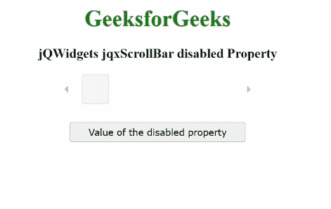

# jQWidgets jqxScrollBar 禁用属性

> 原文:[https://www . geesforgeks . org/jqwidgets-jqxscrollbar-disabled-property/](https://www.geeksforgeeks.org/jqwidgets-jqxscrollbar-disabled-property/)

**jQWidgets** 是一个 JavaScript 框架，用于为 PC 和移动设备制作基于 web 的应用程序。它是一个非常强大、优化、独立于平台并且得到广泛支持的框架。****jqxScrollBar****用于表示提供滚动条的 jQuery 小部件，该滚动条具有滑动的拇指，其位置对应于一个值。****

******禁用属性**用于设置或获取滚动条是否被禁用。****

******语法:******

*   ****要设置*禁用的*属性:****

    ```html
    **$('#jqxScrollBar').jqxScrollBar({ disabled:true });**
    ```

*   ****要禁用*属性:*****

    ```html
    ***var disabled = $('#jqxScrollBar').jqxScrollBar('disabled');*** 
    ```

*******链接文件:**从给定链接下载 [jQWidgets](https://www.jqwidgets.com/download/) 。在 HTML 文件中，找到下载文件夹中的脚本文件。*****

> <link rel="”stylesheet”" href="”jqwidgets/styles/jqx.base.css”" type="”text/css”/"> *****<脚本类型=“text/JavaScript”src =“scripts/jquery . js”></script>
> <脚本类型=“text/JavaScript”src =“jqwidgets/jqxcore . js”></script>
> <脚本类型=“text/JavaScript”src =“jqwidgets/jqxbuttons . js”><*****

*******示例:**以下示例说明了 jQWidgets jqxScrollBar **禁用的** **属性**。在以下示例中，*禁用*属性的值已设置为真。*****

## *****超文本标记语言*****

```html
***<!DOCTYPE html>
<html lang="en">

<head>
    <link rel="stylesheet"
          href="jqwidgets/styles/jqx.base.css"
          type="text/css"/>
    <script type="text/javascript" 
            src="scripts/jquery.js">
    </script>
    <script type="text/javascript" 
            src="jqwidgets/jqxcore.js">
    </script>
    <script type="text/javascript" 
            src="jqwidgets/jqxbuttons.js">
    </script>
    <script type="text/javascript" 
            src="jqwidgets/jqxscrollbar.js">
    </script>
    <script type="text/javascript" 
            src="jqwidgets/jqx-all.js">
    </script>
</head>

<body>
    <center>
        <h1 style="color:green;">
            GeeksforGeeks
        </h1>
        <h3>
            jQWidgets jqxScrollBar disabled Property
        </h3>
        <div id='jqx_Scroll_Bar'></div>
        <input type="button" style="margin: 28px;" 
               id="button_for_disabled" 
          value="Value of the disabled property"/>
        <div id="log"></div>
        <script type="text/javascript">
            $(document).ready(function () {
                $("#jqx_Scroll_Bar").jqxScrollBar({
                    width: 300,
                    height: 40,
                    disabled: true
                });
                $("#button_for_disabled").jqxButton({
                    width: 250
                });
                $("#button_for_disabled").jqxButton().
                    click(function () {
                        var Value_of_disabled =
                            $('#jqx_Scroll_Bar').
                                jqxScrollBar(
                                    'disabled');
                        $("#log").html((
                            Value_of_disabled));
                    });
            });
        </script>
    </center>
</body>

</html>***
```

*******输出:*******

**********

*******参考:**[https://www . jqwidgets . com/jquery widgets-documentation/documentation/jqxscrollview/jquery-scroll view-API . htm](https://www.jqwidgets.com/jquery-widgets-documentation/documentation/jqxscrollbar/jquery-scrollbar-api.htm)*****