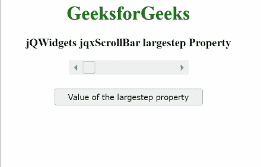

# jQWidgets jqxScrollBar 大步属性

> 原文:[https://www . geesforgeks . org/jqwidgets-jqxscrollbar-large step-property/](https://www.geeksforgeeks.org/jqwidgets-jqxscrollbar-largestep-property/)

**jQWidgets** 是一个 JavaScript 框架，用于为 PC 和移动设备制作基于 web 的应用程序。它是一个非常强大、优化、独立于平台并且得到广泛支持的框架。**jqxScrollBar****用于表示 jQuery 小部件，该部件提供了一个滚动条，该滚动条具有滑动的拇指，其位置对应于一个值。**

****属性用于设置或获取指定 jqxScrollBar 的*大步长*。当在滚动条按钮和拇指之间的区域中按下鼠标左键时，该值随着这个*大步长*值而增加或减少。****

******语法:******

*   ****用于设置*大步长*属性。****

    ```html
    **$('#jqxScrollBar').jqxScrollBar({ largestep: 20 });**
    ```

*   ****获取*大步长*属性。****

    ```html
    **var largestep = 
        $('#jqxScrollBar').jqxScrollBar('largestep');**
    ```

******链接文件:**从给定链接下载 [jQWidgets](https://www.jqwidgets.com/download/) 。在 HTML 文件中，找到下载文件夹中的脚本文件。****

> <link rel="”stylesheet”" href="”jqwidgets/styles/jqx.base.css”" type="”text/css”/"> ****<脚本类型=“text/JavaScript”src =“scripts/jquery . js”></script>
> <脚本类型=“text/JavaScript”src =“jqwidgets/jqxcore . js”></script>
> <脚本类型=“text/JavaScript”src =“jqwidgets/jqxbuttons . js”><****

******示例:**下面的示例说明了 jQWidgets jqxScrollBar*****大步长*** 属性。在下面的例子中，**属性的值被设置为 20。********

## ******超文本标记语言******

```html
****<!DOCTYPE html>
<html lang="en">

<head>
    <link rel="stylesheet"
          href="jqwidgets/styles/jqx.base.css" 
          type="text/css"/>
    <script type="text/javascript" 
            src="scripts/jquery.js">
    </script>
    <script type="text/javascript" 
            src="jqwidgets/jqxcore.js">
    </script>
    <script type="text/javascript" 
            src="jqwidgets/jqxbuttons.js">
    </script>
    <script type="text/javascript" 
            src="jqwidgets/jqxscrollbar.js">
    </script>
    <script type="text/javascript" 
            src="jqwidgets/jqx-all.js">
    </script>
</head>

<body>
    <center>
        <h1 style="color:green;">
            GeeksforGeeks
        </h1>
        <h3>
            jQWidgets jqxScrollBar largestep Property
        </h3>
        <div id='jqx_Scroll_Bar'></div>
        <input type="button" style="margin: 28px;" 
               id="button_for_largestep" 
               value="Value of the largestep property"/>
        <div id="log"></div>
        <script type="text/javascript">
            $(document).ready(function () {
                $("#jqx_Scroll_Bar").jqxScrollBar({
                    width: 200,
                    height: 20,
                    largestep:20
                });
                $("#button_for_largestep").jqxButton({
                    width: 250
                });
                $("#button_for_largestep").jqxButton().
                click(function () {
                    var Value_of_largestep =
                        $('#jqx_Scroll_Bar').jqxScrollBar('largestep');
                        $("#log").html(( Value_of_largestep));
                });
            });
        </script>
    </center>
</body>

</html>****
```

********输出:********

********

******参考:**[https://www . jqwidgets . com/jquery-widgets-documentation/documentation/jqxscrollbar/jquery-scroll bar-API . htm？搜索=](https://www.jqwidgets.com/jquery-widgets-documentation/documentation/jqxscrollbar/jquery-scrollbar-api.htm?search=)****