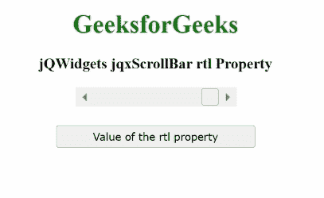

# jqwidgets jqxscroll RTL 性质

> 原文:[https://www . geeksforgeeks . org/jqwidgets-jqxscrollbar-RTL-property/](https://www.geeksforgeeks.org/jqwidgets-jqxscrollbar-rtl-property/)

**jQWidgets****是一个为 PC 和移动设备制作基于 web 的应用的 JavaScript 框架。它是一个非常强大、优化、独立于平台并且得到广泛支持的框架。 **jqxScrollBar** 用于表示一个 jQuery 小部件，该部件提供了一个滚动条，该滚动条具有一个滑动的拇指，其位置对应于一个值。**

*****【RTL】***属性用于设置或获取一个值，该值指示指定的 **jqxScrollBar** 的元素是否与从右向左的字体对齐。**

****语法:****

*   **用于设置 *rtl* 属性。**

    ```html
    $('#jqxScrollBar').jqxScrollBar({ rtl: true });
    ```

*   **获得 *rtl* 房产。**

    ```html
    var rtl = $('#jqxScrollBar').jqxScrollBar('rtl');
    ```

****链接文件:**从给定链接下载 [jQWidgets](https://www.jqwidgets.com/download/) 。在 HTML 文件中，找到下载文件夹中的脚本文件。**

> <link rel="”stylesheet”" href="”jqwidgets/styles/jqx.base.css”" type="”text/css”/"> **<脚本类型=“text/JavaScript”src =“scripts/jquery . js”></script>
> <脚本类型=“text/JavaScript”src =“jqwidgets/jqxcore . js”></script>
> <脚本类型=“text/JavaScript”src =“jqwidgets/jqxbuttons . js”><**

****示例:**以下示例说明了 jQWidgets jqxScrollBar***RTL***属性。在以下示例中， ***rtl*** 属性的值已设置为*真*。**

## **超文本标记语言**

```html
<!DOCTYPE html>
<html lang="en">

<head>
    <link rel="stylesheet"
          href= "jqwidgets/styles/jqx.base.css" 
          type="text/css"/>
    <script type="text/javascript" 
            src="scripts/jquery-1.11.1.min.js">
    </script>
    <script type="text/javascript" 
            src="jqwidgets/jqxcore.js">
    </script>
    <script type="text/javascript" 
            src="jqwidgets/jqxbuttons.js">
    </script>
    <script type="text/javascript" 
            src="jqwidgets/jqxscrollbar.js">
    </script>
    <script type="text/javascript" 
            src="jqwidgets/jqx-all.js">
    </script>
</head>

<body>
    <center>
        <h1 style="color:green;">
            GeeksforGeeks
        </h1>
        <h3>
            jQWidgets jqxScrollBar rtl Property
        </h3>
        <div id='jqx_Scroll_Bar'></div>
        <input type="button" style="margin:28px;" 
               id="button_for_rtl" 
          value="Value of the rtl property"/>
        <div id="log"></div>
        <script type="text/javascript">
            $(document).ready(function () {
                $("#jqx_Scroll_Bar").jqxScrollBar({
                    width: 200,
                    height: 20,
                    rtl: true
                });
                $("#button_for_rtl").jqxButton({
                    width: 250
                });
                $("#button_for_rtl").jqxButton().click(function () {
                        var Value_of_rtl =
                            $('#jqx_Scroll_Bar').jqxScrollBar('rtl');
                        $("#log").html((Value_of_rtl));
                    });
            });
        </script>
    </center>
</body>

</html>
```

****输出:****

****

****参考:**[https://www . jqwidgets . com/jquery-widgets-documentation/documentation/jqxscrollbar/jquery-scroll bar-API . htm？搜索=](https://www.jqwidgets.com/jquery-widgets-documentation/documentation/jqxscrollbar/jquery-scrollbar-api.htm?search=)**