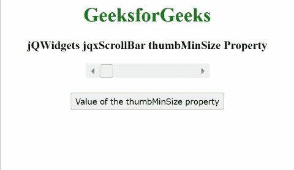

# jQWidgets jqxScrollBar 拇指大小属性

> 原文:[https://www . geesforgeks . org/jqwidgets-jqxscrollbar-thumbminsize-property/](https://www.geeksforgeeks.org/jqwidgets-jqxscrollbar-thumbminsize-property/)

***jQWidgets*** 是一个 JavaScript 框架，用于为 PC 和移动设备制作基于 web 的应用程序。它是一个非常强大、优化、独立于平台并且得到广泛支持的框架。 ***jqxScrollBar*** 用于表示一个 jQuery 小部件，该部件提供了一个滚动条，该滚动条具有一个滑动的拇指，其位置对应于一个值。

***缩略图尺寸*** 属性用于为指定的 **jqxScrollBar** 设置或获取滚动条缩略图的最小尺寸。

**语法:**

*   设置*拇指大小*属性:

    ```
    $('#jqxScrollBar').jqxScrollBar({ thumbMinSize: 10 });
    ```

*   要获取*拇指大小*属性:

    ```
    var thumbMinSize = $('#jqxScrollBar')
            .jqxScrollBar('thumbMinSize');
    ```

**链接文件:**从给定链接下载 [jQWidgets](https://www.jqwidgets.com/download/) 。在 HTML 文件中，找到下载文件夹中的脚本文件。

> <link rel="”stylesheet”" href="”jqwidgets/styles/jqx.base.css”" type="”text/css”/">
> <脚本类型=“text/JavaScript”src =“scripts/jquery . js”></script>
> <脚本类型=“text/JavaScript”src =“jqwidgets/jqxcore . js”></script>
> <脚本类型=“text/JavaScript”src =“jqwidgets/jqxbuttons . js”><

**示例:**下面的示例说明了 jQWidgets jqxScrollBar***thumbMinSize***属性。在下面的例子中， ***拇指大小*** 属性的值被设置为 10。

## 超文本标记语言

```
<!DOCTYPE html>
<html lang="en">

<head>
    <link rel="stylesheet" 
          href="jqwidgets/styles/jqx.base.css"
          type="text/css"/>
    <script type="text/javascript" 
            src="scripts/jquery.js">
    </script>
    <script type="text/javascript" 
            src="jqwidgets/jqxcore.js">
    </script>
    <script type="text/javascript" 
            src="jqwidgets/jqxbuttons.js">
    </script>
    <script type="text/javascript" 
            src="jqwidgets/jqxscrollbar.js">
    </script>
    <script type="text/javascript" 
            src="jqwidgets/jqx-all.js">
    </script>
</head>

<body>
    <center>
        <h1 style="color:green;">
            GeeksforGeeks
        </h1>
        <h3>
            jQWidgets jqxScrollBar thumbMinSize Property
        </h3>
        <div id='jqx_Scroll_Bar'></div>
        <input type="button" style="margin: 28px;" 
               id="button_for_thumbMinSize" 
               value="Value of the thumbMinSize property"/>
        <div id="log"></div>
        <script type="text/javascript">
            $(document).ready(function () {
                $("#jqx_Scroll_Bar").jqxScrollBar({
                    width: 200,
                    height: 20,
                    thumbMinSize: 10
                });
                $("#button_for_thumbMinSize").jqxButton({
                    width: 250
                });
                $("#button_for_thumbMinSize")
                .jqxButton().click(function () {
                    var Value_of_thumbMinSize =
                        $('#jqx_Scroll_Bar')
                        .jqxScrollBar('thumbMinSize');
                    $("#log").html((Value_of_thumbMinSize));
                });
            });
        </script>
    </center>
</body>

</html>
```

**输出:**



**参考:**[https://www . jqwidgets . com/jquery-widgets-documentation/documentation/jqxscrollbar/jquery-scroll bar-API . htm？搜索=](https://www.jqwidgets.com/jquery-widgets-documentation/documentation/jqxscrollbar/jquery-scrollbar-api.htm?search=)