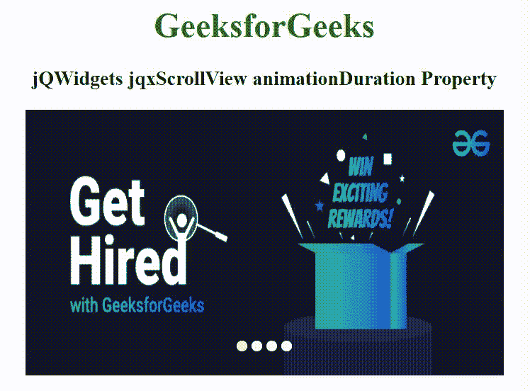

# jQWidgets jqxScrollView 动画持续时间属性

> 原文:[https://www . geesforgeks . org/jqwidgets-jqxscrollview-animation duration-property-2/](https://www.geeksforgeeks.org/jqwidgets-jqxscrollview-animationduration-property-2/)

**jQWidgets** 是一个 JavaScript 框架，用于为 PC 和移动设备制作基于 web 的应用程序。它是一个非常强大、优化、独立于平台并且得到广泛支持的框架。 **jqxScrollView** 是一个 jQuery 小部件，用于查看比设备屏幕上可见区域更宽的内容。可以使用拖动动作或点击位于 **jqxScrollView** 小部件底部的按钮来选择特定元素。

*动画持续时间*属性用于设置或返回当前页面改变时开始的动画持续时间。它接受数字类型值，默认值为 30。

**语法:**

*   设置*动画持续时间*属性。

    ```
    $('selector').jqxScrollView({ animationDuration: Number });
    ```

*   返回*动画持续时间*属性。

    ```
    var animationDuration = 
        $('selector').jqxScrollView('animationDuration');
    ```

**链接文件:**从链接下载 [jQWidgets](https://www.jqwidgets.com/download/) 。在 HTML 文件中，找到下载文件夹中的脚本文件。

> <link rel="”stylesheet”" href="”jqwidgets/styles/jqx.base.css”" type="”text/css”">
> <脚本类型= " text/JavaScript " src = " scripts/jquery-1 . 11 . 1 . min . js "></脚本类型>
> <脚本类型= " text/JavaScript " src = " jqwidgets/jqxcore . js "></脚本类型>
> <脚本类型= " text/JavaScript " src = " jqwidgets/jqx-all . js

**示例:**下面的示例说明了 jQWidgets 中的 jqxScrollView*animation duration*属性。

## 超文本标记语言

```
<!DOCTYPE html>
<html lang="en">

<head>
    <link rel="stylesheet"
          href="jqwidgets/styles/jqx.base.css" 
          type="text/css" />
    <script type="text/javascript" 
            src="scripts/jquery-1.11.1.min.js">
    </script>
    <script type="text/javascript" 
            src="jqwidgets/jqxcore.js">
    </script>
    <script type="text/javascript" 
            src="jqwidgets/jqx-all.js">
    </script>
    <script type="text/javascript" 
            src="jqwidgets/jqxscrollview.js">
    </script>

    <style>
        h1,
        h3 {
            text-align: center;
        }
        #jqxSV {
            width: 100%;
            margin: 0 auto;
        }
    </style>
</head>

<body>
    <h1 style="color:green;">
        GeeksforGeeks
    </h1>

    <h3>
        jQWidgets jqxScrollView animationDuration Property
    </h3>

     <div id="jqxSV">
        
        
        
        
    </div>

    <script type="text/javascript">
        $(document).ready(function () {
            $('#jqxSV').jqxScrollView({
                width: 450,
                height: 250,
                buttonsOffset: [0, 0],
                animationDuration: 2000
            });
        });
    </script>
</body>
</html>
```

**输出:**



**参考:**[https://www . jqwidgets . com/jquery widgets-documentation/documentation/jqxscrollview/jquery-scroll view-API . htm](https://www.jqwidgets.com/jquery-widgets-documentation/documentation/jqxscrollview/jquery-scrollview-api.htm)