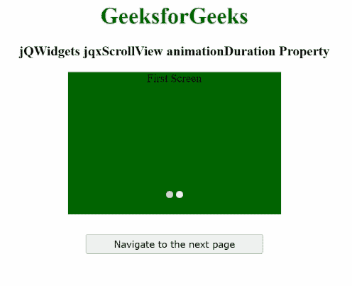

# jQWidgets jqxScrollView 动画持续时间属性

> 原文:[https://www . geesforgeks . org/jqwidgets-jqxscrollview-animation duration-property/](https://www.geeksforgeeks.org/jqwidgets-jqxscrollview-animationduration-property/)

**jQWidgets** 是一个 JavaScript 框架，用于为 PC 和移动设备制作基于 web 的应用程序。它是一个非常强大、优化、独立于平台并且得到广泛支持的框架。 **jqxScrollView** 用于表示小部件，该小部件用于查看比设备屏幕所勾勒的可视区域更宽的内容。在这里，通过拖动或点击/点击 jqxScrollView 底部的按钮来选择特定的项目。

**动画持续时间** **属性**用于设置或获取当前页面改变时开始的动画持续时间。

**语法:**

*   设置*动画持续时间*属性:

    ```html
    $("#jqxScrollView").jqxScrollView({ 
        animationDuration: 4000
    });
    ```

*   获取*动画持续时间*属性:

    ```html
    var animationDuration = $('#jqxScrollView')
        .jqxScrollView('animationDuration');
    ```

**链接文件:**从给定链接下载 [jQWidgets](https://www.jqwidgets.com/download/) 。在 HTML 文件中，找到下载文件夹中的脚本文件。

> <link rel="”stylesheet”" href="”jqwidgets/styles/jqx.base.css”" type="”text/css”/">
> <脚本类型=“text/JavaScript”src =“scripts/jquery . js”></script>
> <脚本类型=“text/JavaScript”src =“jqwidgets/jqxcore . js”></script>
> <脚本类型=“text/JavaScript”src =“jqwidgets/jqxbuttons . js”><

**示例:**下面的示例说明了 jQWidgets jqxScrollView**animation duration****属性**。在下面的例子中，*动画持续时间*属性的值被设置为 4000。

## 超文本标记语言

```html
<!DOCTYPE html>
<html lang="en">

<head>
    <link rel="stylesheet" 
          href="jqwidgets/styles/jqx.base.css"
          type="text/css"/>
    <script type="text/javascript" 
            src="scripts/jquery.js">
    </script>
    <script type="text/javascript" 
            src="jqwidgets/jqxcore.js">
    </script>
    <script type="text/javascript" 
            src="jqwidgets/jqxbuttons.js">
    </script>
    <script type="text/javascript" 
            src="jqwidgets/jqxscrollview.js">
    </script>
    <script type="text/javascript" 
            src="jqwidgets/jqx-all.js">
    </script>
</head>

<body>
    <center>
        <h1 style="color:green;">
            GeeksforGeeks
        </h1>
        <h3>
            jQWidgets jqxScrollView animationDuration Property
        </h3>
        <div id='jqx_Scroll_View'>
            <div style="background-color: #006400">
                First Screen
            </div>
            <div style="background-color: #FF0000">
                Second Screen
            </div>
        </div>
        <input type="button" style="margin: 28px;" 
               id="button_for_animationDuration"
            value="Navigate to the next page"/>
        <script type="text/javascript">
            $(document).ready(function () {
                $("#jqx_Scroll_View").jqxScrollView({
                    width: 300,
                    height: 200,
                    animationDuration: 4000
                });
                $("#button_for_animationDuration").jqxButton({
                    width: 250
                });
                $("#button_for_animationDuration").jqxButton().
                    click(function () {
                        $('#jqx_Scroll_View').
                            jqxScrollView(
                                'forward');
                    });
            });
        </script>
    </center>
</body>

</html>
```

**输出:**



**参考:**[https://www . jqwidgets . com/jquery widgets-documentation/documentation/jqxscrollview/jquery-scroll view-API . htm](https://www.jqwidgets.com/jquery-widgets-documentation/documentation/jqxscrollview/jquery-scrollview-api.htm)