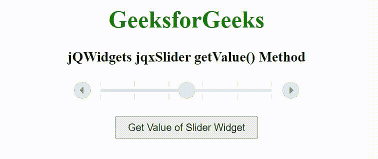

# jQWidgets jqxSlider getValue()方法

> 原文:[https://www . geesforgeks . org/jqwidgets-jqxslider-getvalue-method/](https://www.geeksforgeeks.org/jqwidgets-jqxslider-getvalue-method/)

jQWidgets 是一个 JavaScript 框架，用于为 PC 和移动设备制作基于 web 的应用程序。它是一个非常强大和优化的框架，独立于平台，并得到广泛支持。jqxSlider 是一个 jQuery 小部件，可以用来创建一个从一系列值中进行选择的滑块。它在外观方面定制了小部件，并提供了许多配置选项。

**getValue()方法**用于获取小部件的值。它不接受任何参数，并返回一个数值。

**语法:**

```
$('Selector').jqxSlider('getValue');
```

**链接文件:**从给定的链接 https://www.jqwidgets.com/download/.下载 jQWidgets 在 HTML 文件中，找到下载文件夹中的脚本文件。

> <link rel="”stylesheet”" href="”jqwidgets/styles/jqx.base.css”" type="”text/css”">
> < link rel= "样式表" href = " jqwidgets/style/jqx . energy blue . CSS " type = " text/CSS "/>
> <脚本类型= " text/JavaScript " src = " scripts/jquery-1 . 11 . 1 . min . js "></脚本>
> <脚本类型= " text/JavaScript " src = " jqwidgets/jqxc

下面的例子说明了 jQWidgets jqxSlider getValue()方法。

**示例:**

## 超文本标记语言

```
<!DOCTYPE html>
<html lang="en">

<head>
    <link rel="stylesheet" href=
    "jqwidgets/styles/jqx.base.css" type="text/css" />
    <link rel="stylesheet" href=
    "jqwidgets/styles/jqx.energyblue.css" type="text/css" />
    <script type="text/javascript" 
        src="scripts/jquery-1.11.1.min.js"></script>
    <script type="text/javascript" 
        src="jqwidgets/jqx-all.js"></script>
    <script type="text/javascript" 
        src="jqwidgets/jqxcore.js"></script>
    <script type="text/javascript" 
        src="jqwidgets/jqxbuttons.js"></script>
    <script type="text/javascript" 
        src="jqwidgets/jqxslider.js"></script>
</head>

<body>
    <center>
        <h1 style="color: green;">
            GeeksforGeeks
        </h1>

        <h3>
            jQWidgets jqxSlider getValue() Method
        </h3>

        <div id="jqxSlider"></div>

        <input type="button" id="jqxBtn" 
            value="Get Value of Slider Widget" 
            style="padding: 5px 15px; margin-top: 20px;">
    </center>

    <script type="text/javascript">
        $(document).ready(function() {
            $('#jqxSlider').jqxSlider({
                theme: 'energyblue',
                value: 5
            });

            $('#jqxBtn').on('click', function() {
                var val = $('#jqxSlider').jqxSlider('getValue');
                alert("Value of Slider Widget: " + val);
            });
        });
    </script>
</body>

</html>
```

**输出:**



**参考:**[https://www . jqwidgets . com/jquery-widgets-documentation/documentation/jqxslider/jquery-slider-API . htm](https://www.jqwidgets.com/jquery-widgets-documentation/documentation/jqxslider/jquery-slider-api.htm)