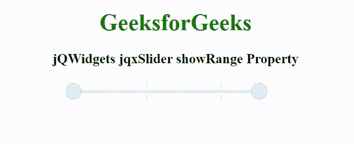

# jQWidgets jqxSlider showRange 属性

> 原文:[https://www . geesforgeks . org/jqwidgets-jqxslider-show range-property/](https://www.geeksforgeeks.org/jqwidgets-jqxslider-showrange-property/)

jQWidgets 是一个 JavaScript 框架，用于为 PC 和移动设备制作基于 web 的应用程序。它是一个非常强大和优化的框架，独立于平台，并得到广泛支持。jqxSlider 是一个 jQuery 小部件，可以用来创建一个从一系列值中进行选择的滑块。它在外观方面定制了小部件，并提供了许多配置选项。

**显示范围属性**用于设置或返回是否显示滑块范围背景。它接受布尔类型值，默认值为真。

**语法:**

设置 showRange 属性。

```html
$('selector').jqxSlider({ showRange: Boolean });
```

返回 showRange 属性。

```html
var showRange = $('selector').jqxSlider('showRange');
```

**链接文件:**从给定的链接 https://www.jqwidgets.com/download/.下载 jQWidgets 在 HTML 文件中，找到下载文件夹中的脚本文件。

> <link rel="”stylesheet”" href="”jqwidgets/styles/jqx.base.css”" type="”text/css”">
> < link rel= "样式表" href = " jqwidgets/style/jqx . energy blue . CSS " type = " text/CSS "/>
> <脚本类型= " text/JavaScript " src = " scripts/jquery-1 . 11 . 1 . min . js "></脚本>
> <脚本类型= " text/JavaScript " src = " jqwidgets/jqxc

下面的例子说明了 jQWidgets jqxSlider showRange 属性。

**示例:**

## 超文本标记语言

```html
<!DOCTYPE html>
<html lang="en">

<head>
    <link rel="stylesheet" href=
    "jqwidgets/styles/jqx.base.css" type="text/css" />
    <link rel="stylesheet" href=
    "jqwidgets/styles/jqx.energyblue.css" type="text/css" />
    <script type="text/javascript" 
        src="scripts/jquery-1.11.1.min.js"></script>
    <script type="text/javascript" 
        src="jqwidgets/jqx-all.js"></script>
    <script type="text/javascript" 
        src="jqwidgets/jqxcore.js"></script>
    <script type="text/javascript" 
        src="jqwidgets/jqxbuttons.js"></script>
    <script type="text/javascript" 
        src="jqwidgets/jqxslider.js"></script>
</head>

<body>
    <center>
        <h1 style="color: green;">
            GeeksforGeeks
        </h1>

        <h3>
            jQWidgets jqxSlider showRange Property
        </h3>

        <div id='content'>
            <div id='jqxslider'></div>
        </div>
    </center>

    <script type="text/javascript">
        $(document).ready(function() {
            $("#jqxslider").jqxSlider({
                theme: 'energyblue',
                showRange:false,
                rangeSlider: true  
            });
        });
    </script>
</body>

</html>
```

**输出:**



**参考:**[https://www . jqwidgets . com/jquery-widgets-documentation/documentation/jqxslider/jquery-slider-API . htm](https://www.jqwidgets.com/jquery-widgets-documentation/documentation/jqxslider/jquery-slider-api.htm)