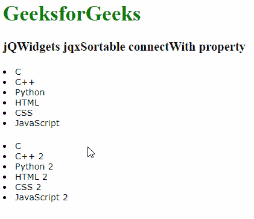

# jQWidgets jqxSortable connect with Property

> 原文:[https://www . geesforgeks . org/jqwidgets-jqxsortable-connectwith-property/](https://www.geeksforgeeks.org/jqwidgets-jqxsortable-connectwith-property/)

**jQWidgets** 是一个 JavaScript 框架，用于为 PC 和移动设备制作基于 web 的应用程序。它是一个非常强大和优化的框架，独立于平台，并得到广泛支持。 **jqxSortable** 代表一个 jQuery 插件，它允许你使用鼠标对 html 列表或 div 标签中的元素重新排序。

**connectWith 属性**用来做一个选择器，用来连接其他列表。它接受布尔/字符串类型的值，默认值为真。

**语法:**

*   设置*连接*属性:

    ```
    $('jqxSortable').jqxSortable({ connectWith : boolean/string });
    ```

*   返回带有属性的*连接:*

    ```
    var connectWith = $('Selector').jqxSortable('connectWith');
    ```

**链接文件:**从给定链接下载 [jQWidgets](https://www.jqwidgets.com/download/) 。在 HTML 文件中，找到下载文件夹中的脚本文件:

> <link type="”text/css”" rel="”stylesheet”" href="”jqwidgets/styles/jqx.base.css”">
> <脚本类型= " text/JavaScript " src = " scripts/jquery-1 . 11 . 1 . min . js "></脚本类型>
> <脚本类型= " text/JavaScript " src = " jqwidgets/jqxcore . js "></脚本类型>
> <脚本类型= " text/JavaScript " src = " jqwidgets/globalize . js

**示例:**以下示例说明了 jQWidgets 中的 jqxSortable **connectWith 属性**:

## 超文本标记语言

```
<!DOCTYPE html>
<html lang="en">

<head>
    <link type="text/css" rel="stylesheet" 
          href="jqwidgets/styles/jqx.base.css" />
    <script type="text/javascript" 
            src="scripts/jquery-1.11.1.min.js">
      </script>
    <script type="text/javascript" 
            src="jqwidgets/jqxcore.js">
      </script>
    <script type="text/javascript" 
            src="jqwidgets/globalization/globalize.js">
      </script>
    <script type="text/javascript" 
            src="jqwidgets/jqxsortable.js">
      </script>
</head>

<body>
    <h1 style="color: green">
          GeeksforGeeks 
    </h1>
    <h3>jQWidgets jqxSortable connectWith property</h3>
    <div id="sort">
        <div class='gfg'><li>C</li></div>
        <div><li>C++</li></div>
        <div><li>Python</li></div>
        <div><li>HTML</li></div>
        <div><li>CSS</li></div>
        <div><li>JavaScript</li></div>
    </div>

    <br/>

    <div id="sort2">
        <div class='gfg'><li>C</li></div>
        <div><li>C++ 2</li></div>
        <div><li>Python 2</li></div>
        <div><li>HTML 2</li></div>
        <div><li>CSS 2</li></div>
        <div><li>JavaScript 2</li></div>
    </div>

    <script type="text/javascript">
        $(document).ready(function () {
            $("#sort").jqxSortable({
               connectWith: "#sort2"
            });

            $("#sort2").jqxSortable({
               connectWith: "#sort"
            });
        });
    </script>
</body>

</html>
```

**输出:**



**参考:**[https://www . jqwidgets . com/jquery-widgets-documentation/documentation/jqxsortable/jquery-sortable-API . htm](https://www.jqwidgets.com/jquery-widgets-documentation/documentation/jqxsortable/jquery-sortable-api.htm)